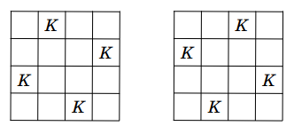
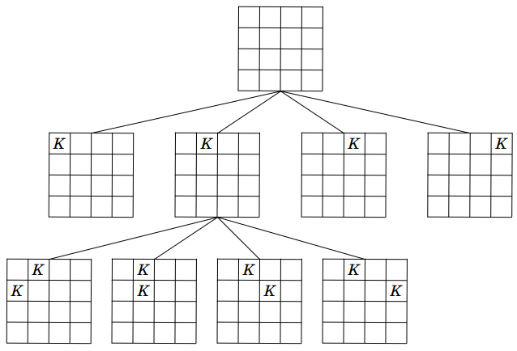

# 7. Trees and recursion

A _tree_ is a data structures that consists of _nodes_ at different levels. A tree can represent a hierarchy through connections between nodes at different levels.

Consider the followong tree:

_Puu_ (_tree_) on tietorakenne, joka muodostuu eri tasoilla olevista _solmuista_ (_node_). Puiden avulla voidaan esittää hierarkioita, joissa eri tasoilla olevat solmut ovat yhteydessä toisiinsa.

Tarkastellaan esimerkkinä seuraavaa puuta:


This tree has seven nodes at three levels.

The top-most node is called the _root_. A _child_ of a node is a lower level node connected to it. A node is the _parent_ of its children. If a node has no children, it is a _leaf_.

Tässä puussa on seitsemän solmua, jotka ovat kolmella tasolla.

Puun ylin solmu on nimeltään _juuri_ (_root_). Solmun _lapsi_ (_child_) on yhtä alemmalla tasolla oleva solmu, johon pääsee kulkemaan solmusta. Solmun _vanhempi_ (_parent_) on solmu, jonka lapsi solmu on. Jos solmulla ei ole lapsia, se on _lehti_ (_leaf_).

In the example, the root of the tree is the node 1. The children of the node 1 are the nodes 4, 5 and 2. The parent of the node 4 is the node 1. The leaves of the tree are the nodes, 3, 7, 5 and 6.

Every node except the root has exactly one parent. This means that any node can be reached from the root by following the node connections downwards and that route of connections is unique. The root has no parent. 

Esimerkissä puun juuri on solmu 1. Solmun 1 lapset ovat solmut 4, 5 ja 2. Solmun 4 vanhempi on solmu 1. Puun lehtiä ovat solmut 3, 7, 5 ja 6.

Jokaisella solmulla juurta lukuun ottamatta on tarkalleen yksi vanhempi. Tämän vuoksi on olemassa yksikäsitteinen reitti juuresta mihin tahansa solmuun kulkemalla yhteyksiä alaspäin. Juurella ei ole vanhempaa.

The _subtree_ of a node consists of all nodes that can be reached by following connections downwards from the node. In the example, the subtree of the node 1 contains all nodes of the tree, and the subtree of the node 4 contains the nodes 4, 3 and 7.

The _depth_ of a node tells how low the node is in the tree. The depth of the root is 0, and the depth of any other node is one bigger than the depth of its parent. In the example, the depth of the node 1 is 0, the depth of the node 4 is 1, and the depth of the node 3 is 2.

The _height_ of a tree is the maximum depth of any node in the tree. In the example, the height of the tree is 2, because 2 is the depth of the nodes 3, 7 and 6.

Solmun _alipuu_ (_subtree_) sisältää solmut, joihin pääsee kulkemalla solmusta alaspäin yhteyksiä pitkin. Esimerkissä solmun 1 alipuu sisältää puun kaikki solmut ja solmun 4 alipuu sisältää solmut 4, 3 ja 7.

Solmun _syvyys_ (_depth_) tarkoittaa, miten matalalla solmu on puussa. Juuren syvyys on 0 ja muilla solmuilla syvyys on yhtä suurempi kuin niiden vanhemman syvyys. Esimerkissä solmun 1 syvyys on 0, solmun 4 syvyys on 1 ja solmun 3 syvyys on 2.

Puun _korkeus_ (_height_) on suurin puussa esiintyvä solmun syvyys. Esimerkissä puun korkeus on 2, koska solmujen 3, 7 ja 6 syvyys on 2.

## Implementing a tree

We can represent a tree in Python using the following class `Node`:

Voimme esittää puun solmun Pythonissa seuraavan luokan `Node` avulla:

```python
class Node:
    def __init__(self, value, children=[]):
        self.value = value
        self.children = children
        
    def __repr__(self):
        return str(self.value)        
```

The construction of a node takes two parameters: the value stored in the node and a list of the children of the node. If no list is given, it is empty by default. For example, the following code creates three nodes so that the nodes 2 and 3 are children of the node 1.

Solmun luonnissa annetaan kaksi tietoa: solmussa oleva arvo sekä lista solmun lapsista. Jos listaa ei anneta, se on oletuksena tyhjä. Esimerkiksi seuraava koodi luo kolme solmua niin, että solmut 2 ja 3 ovat solmun 1 lapsia.

```python
node2 = Node(2)
node3 = Node(3)
node1 = Node(1, [node2, node3])
```

The string representation of a node is the value in the node:

Solmun merkkijonoesityksenä on solmussa oleva arvo:

```python
node = Node(1)
print(node) # 1
```

With this class, we can define a tree by building the root node of the tree. For example, the following code creates the example tree at the beginning of the chapter:

Tämän luokan avulla puu voidaan määritellä rakentamalla sen juurisolmu. Esimerkiksi seuraava koodi luo luvun alussa olleen esimerkkipuun:
        
```python
tree = Node(1, [Node(4, [Node(3), Node(7)]),
                Node(5),
                Node(2, [Node(6)])])
```

### Traversing a tree

A natural way to process a tree is using recursion. For example the following function `traverse` goes through all the nodes that are in the subtree of the node `node`:

Luonteva tapa käsitellä puuta on käyttää rekursiota. Esimerkiksi seuraava funktio `traverse` käy läpi kaikki solmut, jotka ovat solmun `node` alipuussa:

```python
def traverse(node):
    print(node)
    for child in node.children:
        traverse(child)
```

When the function is given a reference to the root of a tree, it traverses all the nodes in the tree:

Kun funktiolle annetaan viittaus puun juureen, funktio käy läpi kaikki puun solmut:

```python
traverse(tree)
```

Given the example tree, the function prints:

Esimerkkipuussa funktion tulostus on seuraava:

```
1
4
3
7
5
2
6
```

The function `traverse` starts by printing the value of the given node. Then the function iterates through the children of the node (`node.children`) and calls itself recursively for each child.

We can further illustrate the operation of the function with the following modification:

Funktio `traverse` tulostaa ensin sille annetun solmun arvon (`node.value`). Tämän jälkeen funktio käy läpi kaikki solmun lapset (`node.children`) ja kutsuu jokaisen lapsen kohdalla itseään rekursiivisesti.

Voimme vielä selventää funktion toimintaa muuttamalla sitä seuraavasti:

```python
def traverse(node):
    print("enter", node.value)
    for child in node.children:
        traverse(child)
    print("leave", node.value)
```

Now the function prints "enter $$x$$", when the processing of a node $$x$$ starts, and "leave $$x$$", when the processing of the node $$x$$ ends. For the example tree, the modified function prints:

Nyt funktio tulostaa "enter $$x$$", kun solmun $$x$$ käsittely alkaa, ja "leave $$x$$", kun solmun $$x$$ käsittely päättyy. Esimerkkipuussa funktio tulostaa:

```
enter 1
enter 4
enter 3
leave 3
enter 7
leave 7
leave 4
enter 5
leave 5
enter 2
enter 6
leave 6
leave 2
leave 1
```

## Computing information from a tree

Trees are often processed using recursive functions that compute some value related to the tree. As an example, let us consider a function `count_nodes` that counts how many nodes are in the subtree of the node `node`:

Puita käsitellään usein funktioilla, jotka laskevat rekursiivisesti jonkin puuhun liittyvän tiedon. Tarkastellaan esimerkkinä funktiota `count_nodes`, joka laskee, montako solmua on solmun `node` alipuussa:

```python
def count_nodes(node):
    result = 1
    for child in node.children:
        result += count_nodes(child)
    return result
```

The function can be used as follows:

Funktiota voidaan käyttää näin:

```python
tree = Node(1, [Node(4, [Node(3), Node(7)]),
                Node(5),
                Node(2, [Node(6)])])

print(count_nodes(tree)) # 7
```

The function computes the node count into the variable `result`. The initial value of the variable is 1, because it includes the node `node` itself. Then the function goes through the children of the node and recursively counts the nodes in the subtrees of the children.

Consider how the function counts the nodes in the example:

Funktio laskee solmujen määrän muuttujaan `result`. Muuttujan alkuarvo on 1, jolloin siihen on laskettu mukaan solmu `node`. Tämän jälkeen funktio käy läpi solmun lapset ja laskee mukaan rekursiivisesti solmujen määrät lasten alipuissa. Lopuksi funktio palauttaa solmujen määrän.

Katsotaan tarkemmin, miten funktio laskee solmujen määrän esimerkissä:


When the function is given the node 1, the variable `result` is initialized with 1, and the node counts of the children are added to it. The children of the node 1 are the nodes 4, 5 and 2. The subtree of the node 4 has 3 nodes, the subtree of the node 5 has 1 node, and the subtree of the node 2 has 2 nodes. Thus 3, 1 and 2 are added to the variable `result` and the final node count is 1 + 3 + 1 + 2 = 7.

We can further illustrate the operation of the function using print outs:

Kun funktiolle annetaan viittaus solmuun 1, muuttuja `result` on alussa 1 ja funktio lisää siihen silmukassa solmun 1 lasten solmujen määrät. Solmun 1 lapset ovat solmut 4, 5 ja 2. Solmun 4 alipuussa on 3 solmua, solmun 5 alipuussa on 1 solmu ja solmun 2 alipuussa on 2 solmua. Niinpä muuttujaan `result` lisätään määrät 3, 1 ja 2 ja solmujen määräksi saadaan 1 + 3 + 1 + 2 = 7.

Voimme vielä selventää funktion toimintaa lisäämällä siihen tulostusta:

```python
def count_nodes(node):
    result = 1
    for child in node.children:
        result += count_nodes(child)
    print("subtree of node", node, "has", result, "nodes")
    return result
```

Now the function prints out the subtree node count for all nodes:

Tämän muutoksen jälkeen funktio tulostaa jokaisesta solmusta tiedon, montako solmua sen alipuussa on:

```
subtree of node 3 has 1 nodes
subtree of node 7 has 1 nodes
subtree of node 4 has 3 nodes
subtree of node 5 has 1 nodes
subtree of node 6 has 1 nodes
subtree of node 2 has 2 nodes
subtree of node 1 has 7 nodes
```

Many values related to trees can be computed using the same approach: define some variables, iterate through the children recursively, and update the variables appropriately. For example, the following function computes the height of the tree, i.e., the maximum depth of any node in the tree:

Monia puihin liittyviä asioita voidaan laskea samalla idealla: määritellään sopivat muuttujat, käydään läpi silmukassa solmun lapset rekursiivisesti ja päivitetään muuttujia sopivalla tavalla. Esimerkiksi seuraava funktio `count_height` laskee puun korkeuden eli suurimman puussa olevan solmun syvyyden:

```python
def count_height(node):
    result = 0
    for child in node.children:
        result = max(result, count_height(child) + 1)
    return result
```

In this case, the loop goes through the children and chooses the biggest subtree height added by one using the function `max`. In the example tree, the subtree heights of the children of the node 1 are 1, 0 and 1. The biggest height is 1, with the addition of 1, the resulting subtree height of the node 1 is 2.

Tässä tapauksessa silmukka käy läpi solmun lapset ja valitsee funktion `max` avulla suurimman alipuun korkeuden, johon lisätään 1. Esimerkkipuussa solmun 1 lasten alipuiden korkeudet ovat 1, 0 ja 1. Näistä valitaan suurin korkeus 1, johon lisätään 1, josta saadaan solmun 1 alipuun korkeudeksi 2.

## Computing depths

Sometimes it is useful to a add parameter to the recursive function to keep track of the depth of a node. For example, the following function prints out the depth of every node:

Välillä hyödyllinen tekniikka on lisätä rekursiiviseen funktioon parametri, joka pitää yllä käsiteltävän solmun syvyyttä. Esimerkiksi seuraava funktio tulostaa puun jokaisen solmun syvyyden.

```python
def traverse(node, depth):
    print("node", node, "depth", depth)
    for child in node.children:
        traverse(child, depth + 1)
```

The initial call of the function is given the root of the tree and the depth 0, and each step deeper in the tree increments the depth by one. The function can be used as follows:

Funktiota kutsuttaessa juuren syvyydeksi annetaan 0, ja funktio kasvattaa syvyyttä yhdellä aina liikkuessaan alempaan solmuun. Funktiota voidaan käyttää näin:

```python
tree = Node(1, [Node(4, [Node(3), Node(7)]),
                Node(5),
                Node(2, [Node(6)])])

traverse(tree, 0)
```

In this case, the output is:

Tässä tapauksessa tulostus on:

```
node 1 depth 0
node 4 depth 1
node 3 depth 2
node 7 depth 2
node 5 depth 1
node 2 depth 1
node 6 depth 2
```

Let us next design a more complicated function `get_depths` that returns the node depths as a list ordered from the smallest to the biggest depth. With the example tree, the function should return the list [0, 1, 1, 1, 2, 2, 2]`. A good way to implement a function like this is to define a helper function that has more parameters:

Tehdään seuraavaksi monimutkaisempi funktio `get_depths`, jonka tulisi palauttaa listana kaikkien puun solmujen syvyydet pienimmästä suurimpaan. Esimerkkipuussa funktion tulisi palauttaa lista `[0, 1, 1, 1, 2, 2, 2]`. Hyvä tapa tehdä tällainen funktio on tehdä sen avuksi toinen funktio, jolla on enemmän parametreja:

```python
def get_depths(node):
    depths = []
    get_depths_helper(node, 0, depths)
    return sorted(depths)
    
def get_depths_helper(node, depth, depths):
    depths.append(depth)
    for child in node.children:
        get_depths_helper(child, depth + 1, depths)
```

The function can be used as follows:

Funktio toimii nyt näin:

```python
tree = Node(1, [Node(4, [Node(3), Node(7)]),
                Node(5),
                Node(2, [Node(6)])])

print(get_depths(tree)) # [0, 1, 1, 1, 2, 2, 2]
```

The function `get_depths` first creates a list `depths` for storing the depths. Then the function calls the helper function `get_depth_helper` that adds the dpeths to the list. Finally the function `get_depths` sorts and returns the list.

Tässä funktio `get_depths` luo ensin listan `depths` solmujen syvyyksille. Tämän jälkeen funktio kutsuu funktiota `get_depths_helper`, joka lisää syvyydet listalle. Lopuksi funktio `get_depths` palauttaa listan järjestettynä.

The function `get_depths_helper` has two additional paramaters: the parameter `depth`, which keeps track of the depth of the current node, and the parameter `depths`, which is a reference to the list of depths. Notice that, since Python passes lists as by reference, all the depths are added to the same list defined in the function `get_depth`. This way we can collect data from different function calls to the same list.

Below is another way to implement the two functions. This time the function `get_depths_helper` does not get the list as a parameter but returns the list:

Funktiolla `get_depths_helper` on kaksi lisäparametria: parametri `depth` pitää yllä tietoa solmun syvyydestä ja parametri `depths` on viittaus listaan, johon syvyydet tallennetaan. Huomaa, että koska Pythonissa lista välitetään viittauksena, kaikki syvyydet lisätään samalle listalle, joka on määritelty funktiossa `get_depths`. Tämän ansiosta tiedot saadaan kerättyä samalle listalle eri funktiokutsuista.

Tässä on vielä toinen tapa toteuttaa funktio `get_depths`, jossa funktiolle `get_depths_helper` ei anneta parametrina listaa vaan funktio palauttaa listan.

```python
def get_depths(node):
    return sorted(get_depths_helper(node, 0))

def get_depths_helper(node, depth):
    depths = [depth]
    for child in node.children:
        depths += get_depths_helper(child, depth + 1)
    return depths
```

Now the function `get_depths_helper` creates a list initially containing the depth of the current node. Then the function computes the lists for the child subtrees recursively and adds those lists into its own list. The function `get_depths` gets the list of depths from the helper function and returns it in sorted order.

Tässä tapauksessa funktio `get_depths_helper` muodostaa listan, johon lisätään ensin käsiteltävän solmun syvyys ja sitten alipuiden listat, jotka saadaan rekursiivisesti. Funktio `get_depths` saa lopulta listan, jossa on kaikkien solmujen syvyydet, ja funktio palauttaa tämän listan järjestettynä.

## Improving the class

Let us return to the definition of the class `Node`:

Tarkastellaan vielä luokan `Node` määrittelyä:

```python
class Node:
    def __init__(self, value, children=[]):
        self.value = value
        self.children = children
        
    def __repr__(self):
        return str(self.value)        
```

As we have seen, the class works well in many cases, but there is feature of Python that can cause problems in some cases. The following code illustrates this:

Luokka toimii tällaisenaan yleensä hyvin, mutta  Pythonissa on yllättävä piirre, joka voi aiheuttaa ongelmia joissakin tilanteissa. Seuraava koodi esittelee asiaa:

```python
node1 = Node(1)
node2 = Node(2)

node1.children.append(node2)

print(node1.children) # [2]
print(node2.children) # [2]
```

Here we create two nodes without children and then add the node 2 as a child of the node 1. Surprisingly, this has the effect of adding the node 2 as its own child too.

This effect is caused by the default parameter `[]`, which is created only once and _shared_ between all calls of the method. Thus both nodes refer to the same empty list and any additions to the list are seen by both nodes. 

We can fix the issue by modifying the constructor as follows:

Tässä luotiin kaksi solmua, joilla ei ole lapsia, minkä jälkeen solmun 1 lapseksi lisättiin solmu 2. Yllättäen kuitenkin solmu 2 ilmestyi myös itsensä lapseksi.

Tämä ilmiö johtuu siitä, että oletusparametri `[]` luodaan vain kerran ja se on _yhteinen_ kaikille metodikutsuille. Tämän vuoksi molemmat solmut viittaavat samaan tyhjään listaan, johon lisätty solmu näkyy kummallekin solmulle.

Voimme korjata asian muuttamalla alustusmetodia näin:

```python
class Node:
    def __init__(self, value, children=None):
        self.value = value
        self.children = children if children else []
        
    def __repr__(self):
        return str(self.value)        
```

Now the default value of the parameter `children` is `None`. If no parameter is supplied, the method creates an empty list. After this modification, each node gets its own empty list and the code works as expected:

Nyt parametrin `children` oletusarvo on `None`. Jos parametria ei ole annettu, alustusmetodi luo tyhjän listan. Tämän muutoksen jälkeen jokainen olio saa oman tyhjän listan ja koodi toimii järkevästi:

```python
node1 = Node(1)
node2 = Node(2)

node1.children.append(node2)

print(node1.children) # [2]
print(node2.children) # []
```

A second issue with the class is that printing a node prints only node value and no information about its children:

Vielä toinen puute luokassa on, että solmun tulostaminen näyttää vain solmussa olevan arvon eikä solmun lapsia:

```python
tree = Node(1, [Node(2, [Node(3), Node(4)]), Node(5)])
print(tree) # 1
```

As a principle in Python, the method `__repr__` should return a string that can be used for constructing the object. This is not the case with the above function `__repr__`.

We can fix this as follows:

Pythonissa on periaatteena, että metodin `__repr__` tulisi antaa sellainen merkkijonoesitys oliosta, joka luo olion. Tämä ei selkeästi toteudu tällä hetkellä.

Voimme korjata asian muuttamalla luokkaa näin:

```python
class Node:
    def __init__(self, value, children=None):
        self.value = value
        self.children = children if children else []
        
    def __repr__(self):
        if self.children == []:
            return f"Node({self.value})"
        else:
            return f"Node({self.value}, {self.children})"
```

Now printing a node outputs a string that includes all the nodes in the child subtrees too and could be used for creating the object:

Tämän jälkeen solmun tulostaminen antaa merkkijonoesityksen, joka sisältää myös solmun lapset ja jonka perusteella olio voitaisiin luoda:

```python
tree = Node(1, [Node(2, [Node(3), Node(4)]), Node(5)])
print(tree) # Node(1, [Node(2, [Node(3), Node(4)]), Node(5)])
```

## Example: Employees

Trees can be used for representing hierarchical structures. For example, the personel structure of an organization could be represented as a tree, where each employee is a node, and the children of the node are the subordinates of the employee.

The following class can be used for storing the name of an employee and a list of the employee's subordinates:

Puiden avulla voidaan mallintaa monia hierarkisia rakenteita. Esimerkiksi organisaation henkilöstörakenne voidaan esittää puuna, jossa jokainen työntekijä on yksi puun solmuista ja solmun lapset ovat työntekijän alaiset.

Seuraavaan luokkaan voidaan tallentaa työntekijän nimi ja lista alaisista:

```python
class Employee:
    def __init__(self, name, subordinates=[]):
        self.name = name
        self.subordinates = subordinates
        
    def __repr__(self):
        return self.name
```

The class can be used as follows:

Luokkaa voidaan käyttää näin:

```python
def list_employees(employee, level=0):
    print(" "*(level*4), employee)
    for subordinate in employee.subordinates:
        list_employees(subordinate, level + 1)

staff = Employee("Emilia",
                 [
                    Employee("Antti"),
                    Employee("Leena", [Employee("Jussi")]),
                    Employee("Matti", [Employee("Sasu")])
                 ])

list_employees(staff)
```

The output of the code is as follows:

Koodin tulostus on:

```
Emilia
    Antti
    Leena
        Jussi
    Matti
        Sasu
```

## Example: Queens

A systematic iteration of possible solutions to a problem can be seen as a traversal of a tree. This technique of solving a problem is knowns as _backtracking_. Let us consider the following problem as an example:

Ongelman ratkaisuiden järjestelmällinen läpikäynti voidaan myös nähdä puun läpikäyntinä. Tämä menetelmä tunnetaan nimellä _peruuttava haku_ (_backtracking_). Tarkastellaan esimerkkinä seuraavaa tehtävää:

{: .note-title }
Task
<div class="note" markdown="1">

How many ways can you place $$n$$ queens on a $$n \times n$$ chess board so that no two queens attack each other?

For example, when $$n=4$$, there are $$2$$ solutions:

Monellako tavalla $$n \times n$$ shakkilaudalle voidaan sijoittaa $$n$$ kuningatarta niin, että mitkään kaksi kuningatarta eivät uhkaa toisiaan?

Esimerkiksi kun $$n=4$$, ratkaisuja on $$2$$:



</div>

We can solve the task by traversing a tree, where the root represents an empty board. Each non-root node represents a board obtained modifiying the board of its parent by adding one more queen to an empty row. The following image shows a part of the tree corresponding to the case $$n=4$$:

Voimme lähestyä ongelmaa käymällä läpi puuta, jonka juurena on tyhjä ruudukko. Jokaisessa solmussa lapsia ovat ruudukot, joihin on lisätty kuningatar seuraavalle riville. Seuraava kuva näyttää osan tapaukseen $$n=4$$ liittyvästä puusta:



By traversing the tree, we will encounter all the valid solutions with $$n$$ queens that do not attack each other, and we can count them. We will also encounter invalid solutions, where two queens attack each other, and partial solutions with less than $$n$$ queens. The invalid solutions are discarded and the partial solutions are extended by adding more queens. Notice that the tree is never stored explicitly in memory but is build during the traversal.

The following code implements the traversal:

Tällä tavalla voidaan käydä läpi kaikki mahdolliset tavat lisätä kuningattaret ruudukkoon ja laskea mukaan ratkaisut, joissa kaksi kuningatarta ei uhkaa toisiaan. Huomaa, että puuta ei ole olemassa valmiina muistissa vaan sitä rakennetaan samaan aikaan läpikäynnin kanssa.

Seuraava koodi toteuttaa läpikäynnin:

```python
def count_queens(n):
    return count(n, 0, [])

def count(n, row, queens):
    if row == n:
        return 1
    result = 0
    for col in range(n):
        attacks = [attack(queen, (row, col)) for queen in queens]
        if not any(attacks):
            result += count(n, row + 1, queens + [(row, col)])
    return result

def attack(queen1, queen2):
    if queen1[0] == queen2[0] or queen1[1] == queen2[1]:
        return True
    if abs(queen1[0] - queen2[0]) == abs(queen1[1] - queen2[1]):
        return True
    return False

print(count_queens(4)) # 2
print(count_queens(8)) # 92
```

The function `count` is given three parameters: the size of the board, the next empty row, and the list of queens already placed on the board. The rows and columns are numbered $$0 \dots n$-1$ and the queens are represented as pairs $$(y,x)$$, where $$y$$ is the row and $$x$$ is the column of the queen's location. The function goes through all the columns, checks if a new queen can be placed at the column without attacking any other queens, and if it can, processes that placement recursively.

The function `attack` handles the attack checks. The condition on the first line checks if the two queens attack are on the same row or the same column. The second condition checks if the queens attack each other diagonally. If they do, their horizotal and vertical coordinates differ by the same amount.

The function `any` in the code returns `True` if the given list contains `True` at least once. Thus `not any(attacks)` means that the list `attacks` contains only `False` values, i.e., that the new queen attacks none of the previously placed queens.

Funktiolle `count` annetaan kolme parametria: ruudukon koko, seuraavaksi lisättävän kuningattaren rivi sekä lista lisätyistä kuningattarista. Rivit ja sarakkeet on numeroitu $$0 \dots n-1$$ ja kuningattaret esitetään muodossa $$(y,x)$$, jossa $$y$$ ja $$x$$ ovat kuningattaren rivi ja sarake. Funktio käy läpi kaikki sarakkeet ja jatkaa hakua rekursiivisesti tilanteissa, joissa kuningatar voidaan lisätä sarakkeeseen ilman, että se uhkaa aiemmin lisättyä kuningatarta.

Funktio `attack` tarkastaa, uhkaavatko kaksi kuningatarta toisiaan. Ensimmäinen ehto tarkastaa tapaukset, joissa kuningattaret uhkaavat toisiaan vaaka- tai pystysuuntaisesti. Toinen ehto puolestaan tarkastaa tapaukset, joissa kuningattaret uhkaavat toisiaan vinosuuntaisesti. Tämä voidaan tunnistaa siitä, että vaaka- ja pystysuuntaisten etäisyyksien itseisarvot ovat samat.

Koodissa on käytössä kätevä funktio `any`, joka palauttaa arvon `True` silloin, kun annetulla listalla on ainakin kerran arvo `True`. Niinpä `not any(attacks)` tarkoittaa, että jokainen listan `attacks` arvo on `False` eli lisättävä kuningatar ei uhkaa mitään aiemmin lisättyä kuningatarta.
