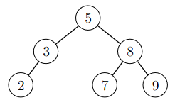
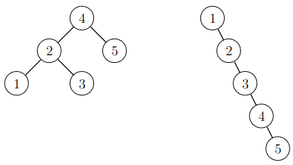
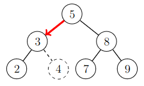

# 12. Binary search tree

Binary search tree is a data structure that maintains a set of elements. The basic operations are the same as with hashing: elements can be added, searched and removed efficiently.

Binary search tree differs from hashing in that it maintains the elements in order. Because of this, the smallest and the largest element in the set can be found efficiently, which is not possible with hashing.

The Python standard library does not have an implementation of a binary search tree, which them a little bit more difficult to use in Python. In this chapter, we develop our _own_ implementation of the binary search tree.

_Binäärihakupuu_ (_binary search tree_) on tietorakenne, joka pitää yllä joukkoa alkioista. Sen perustoiminnot ovat samat kuin hajautuksessa: alkioita pystyy lisäämään, etsimään ja poistamaan tehokkaasti.

Binäärihakupuun keskeinen ero hajautukseen verrattuna on, että se säilyttää alkioita suuruusjärjestyksessä. Tämän ansiosta voidaan etsiä esimerkiksi tehokkaasti joukon pienin tai suurin alkio, mikä ei olisi mahdollista hajautuksen avulla.

Pythonin standardikirjastossa ei ole binäärihakupuun toteutusta, minkä vuoksi sen käyttäminen Pythonissa on hankalampaa kuin hajautuksen käyttäminen. Tässä luvussa toteutamme _itse_ binäärihakupuun Pythonilla.

## Set as a binary tree

A binary search tree is a binary tree, where each node stores one element of the set. For example, the following binary search tree corresponds to the set $$\{2,3,5,7,8,9\}$$:

Binäärihakupuu on binääripuu, jonka jokaisessa solmussa on yksi joukon alkioista. Esimerkiksi seuraava binäärihakupuu vastaa joukkoa $$\{2,3,5,7,8,9\}$$:



A binary search tree is organized so that for every node the elements in the left subtree are smaller that the element in the node, and symmetrically the elements in the right subtree are larger than the element in the node. For example in the tree above, the elements in the left subtree of the root are $$2$$ and $$3$$, which are smaller than the root element $$5$$. Similarly, the elements  in the right subtree are $$7$$, $$8$$ and $$9$$, all of which are larger than the root element $$5$$.

The elements can be located freely in the binary tree as long as the above ordering condition is satisfied by every node. Thus the same set can be represented by different binary search trees. For example, the following two binary search trees both represent the set $$\{1,2,3,4,5\}$$:

Binäärihakupuun alkiot on järjestetty niin, että jokaisessa solmussa kaikki vasemman alipuun alkiot ovat pienempiä kuin solmun alkio ja vastaavasti kaikki oikean alipuun alkiot ovat suurempia kuin alkio. Esimerkiksi yllä olevassa kuvassa juuren vasemman alipuun alkiot $$2$$ ja $$3$$ ovat pienempiä kuin juuren alkio $$5$$. Vastaavasti juuren oikean alipuun alkiot $$7$$, $$8$$ ja $$9$$ ovat suurempia kuin juuren alkio $$5$$.

Huomaa, että solmujen sijoittuminen binäärihakupuuhun voidaan valita muuten vapaasti, kunhan äsken mainittu järjestykseen liittyvä ehto pätee. Niinpä on erilaisia tapoja esittää tietty joukko binäärihakupuuna. Esimerkiksi seuraavat kaksi binäärihakupuuta vastaavat molemmat joukkoa $$\{1,2,3,4,5\}$$:



Let us next consider how set operations can be implemented using a binary search tree.

Katsotaan seuraavaksi, miten binäärihakupuun avulla voidaan toteuttaa joukkoon liittyviä operaatioita.

### Finding an element

When searching for an element, we start at the root. If the element in the node is smaller than the query element, the search continues in the right subtree. If the element in the node is larger than the query element, the search continues in the left subtree. This continues until we find the element, or until there is no child in the direction where the search should continue. The latter case means that the query element is not in the set.

For example, the search route for an element $$7$$ is illustrated by the following image:

Kun halutaan etsiä joukosta alkiota, lähdetään liikkeelle puun juuresta. Jos solmussa oleva alkio on pienempi kuin etsittävä alkio, siirrytään oikeaan lapseen. Jos solmussa oleva alkio on suurempi kuin etsittävä alkio, siirrytään vasempaan lapseen. Näin jatketaan, kunnes haluttu alkio on löytynyt tai solmulla ei ole lasta, johon tulisi siirtyä. Jälkimmäinen tapaus tarkoittaa, ettei etsittävää alkiota ole joukossa.

Esimerkiksi alkio $$7$$ voidaan löytää puusta kulkemalla seuraavaa reittiä:


The search starts at the root, where the element is $$5$$. This is smaller than the element $$7$$ and the search continues in the right child. The element there is $$8$$, which is lager than the element $$7$$. Thus the search continues to the left child, where the element $$7$$ is found. 

Alkion etsiminen alkaa juuresta, jossa on alkio $$5$$. Koska tämä on pienempi kuin etsittävä alkio $$7$$, siirrytään oikeaan lapseen. Tässä solmussa on alkio $$8$$, joka on suurempi kuin etsittävä alkio $$7$$. Niinpä haku jatkuu vasempaan lapseen, josta löytyy etsittävä alkio $$7$$.

### Adding an element

When adding an element, the first stage is to search for the element in the set. If the element is found, no addition is performed, because a set can contain an element only once. If the element is not found, a new node is inserted where the seach would have continued next, and the new element is stored in the new node.

For example, the following image illustrates the addition of an element $$4$$:

Joukkoon voidaan lisätä alkio etsimällä ensin alkiota joukosta. Jos alkio löytyy, sitä ei lisätä, koska sama alkio voi esiintyä joukossa vain kerran. Jos alkiota ei löydy, puuhun lisätään uusi solmu siihen kohtaan, johon haku olisi edennyt seuraavaksi, ja uusi alkio sijoitetaan siihen.

Esimerkiksi alkio $$4$$ voidaan lisätä joukkoon seuraavasti:



The search for the element $$4$$ start at the root, where the element is $$5$$. Next the search goes to the left child, where the element is $$3$$. Here the search should continue to the right child but the node has no right child. This means that the element $$4$$ is not in the tree, and a new node storing the element $$4$$ is added as that missing right child. This ensures that a later search for the element $$4$$ will reach the node.

Alkion $$4$$ etsiminen alkaa juuresta, jossa on alkio $$5$$. Tästä siirrytään vasempaan lapseen, jossa on alkio $$3$$. Tästä tulisi siirtyä oikeaan lapseen, mutta solmulla ei ole oikeaa lasta. Tämä tarkoittaa, ettei alkiota $$4$$ ole vielä puussa ja se tulee lisätä solmun oikeaksi lapseksi. Tämän ansiosta alkio löytyy, kun sitä etsitään myöhemmin.

### Smallest element

A search for the smallest element of the set starts at the root and always continue to the child as long as possible. When going left is no more possible, the smallest element has been found.

Joukon pienin alkio löytyy lähtemällä liikkeelle juuresta ja etenemällä solmun vasempaan lapseen niin kauan, kuin tämä on mahdollista. Kun tämä ei ole enää mahdollista, pienin alkio on löytynyt.

### Largest element

A search for the largest element follows a similar procedure but always goes to the right instead of the left.

Tässä voidaan menetellä vastaavasti kuin pienimmän alkion etsimisessä, mutta joka vaiheessa siirrytään solmun oikeaan lapseen.

### Successor

The successor of an element $$x$$ in the set is the smallest element that is larger than $$x$$. A search for the successor starts at the root

Tavoitteena on löytää pienin alkio, joka on suurempi kuin $$x$$. Lähdetään liikkeelle juuresta ja siirrytään vasempaan lapseen aina, kun solmun alkio on suurempi kuin $$x$$, ja muuten oikeaan lapseen. Haku päättyy, kun siirtyminen ei ole mahdollista. Haluttu alkio on pienin alkiota $$x$$ suurempi alkio kaikista alkioista, joiden kautta reitti kulki.

### Predecessor

Tavoitteena on löytää suurin alkio, joka on pienempi kuin $$x$$. Tässä voidaan toimia käänteisesti edelliseen kohtaan verrattuna: siirrytään oikeaan lapseen aina, kun solmun alkio on pienempi kuin $$x$$. Haluttu alkio on suurin alkiota $$x$$ pienempi alkio reitillä olleista alkioista.

### Alkion poistaminen

Kun joukosta halutaan poistaa alkio, etsitään ensin alkiota vastaava solmu puusta. Tässä on kolme mahdollista tapausta:

* Solmulla ei ole lapsia. Tällöin solmu voidaan poistaa suoraan puusta.
* Solmulla on yksi lapsi. Tällöin voidaan poistaa solmu puusta ja siirtää sen tilalle solmun ainoa lapsi.
* Solmulla on kaksi lasta. Tällöin etsitään pienin alkiota suurempi alkio ja vaihdetaan keskenään näiden solmujen alkiot. Tämän jälkeen alkio on helppoa poistaa, koska sen solmulla on enintään yksi lapsi.

Seuraava kuva näyttää esimerkin, jossa halutaan poistaa alkio $$5$$. Koska alkion $$5$$ solmulla on kaksi lasta, vaihdetaan ensin keskenään alkiot $$5$$ ja $$7$$. Tämän jälkeen alkio $$5$$ on helppoa poistaa, koska sillä ei ole lasta.


Huomaa, että kahden lapsen tapauksessa pienimmän alkiota suuremman alkion etsiminen takaa, että uudella solmulla ei voi olla kahta lasta. Niinpä uuden solmun pystyy aina poistamaan helposti.

## Toteutus Pythonilla

Aletaan seuraavaksi toteuttaa binäärihakupuuta Pythonilla. Tavoitteena on saada aikaan luokka `TreeSet`, jota voidaan käyttää seuraavasti:

```python
s = TreeSet()

s.add(1)
s.add(2)
s.add(3)

print(2 in s) # True
print(4 in s) # False

print(s) # [1, 2, 3]
```

Tässä metodi `add` lisää alkion joukkoon, operaattori `in` ilmoittaa, onko alkio joukossa, ja joukon merkkijonoesityksenä on lista sen alkioista.

Seuraava luokka `Node` sisältää tiedon puussa olevasta solmusta:

```python
class Node:
    def __init__(self, value):
        self.value = value
        self.left = None
        self.right = None
```

Jokaiseen solmuun liittyy kolme tietoa: solmussa olevan alkion arvo (`value`) sekä viittaus solmun vasempaan ja oikeaan lapseen (`left` ja `right`).

Luokka `TreeSet` sisältää varsinaisen binäärihakupuun toteutuksen. Tässä on pohja luokalle:

```python
class TreeSet:
    def __init__(self):
        self.root = None
```

Metodi `__init__` luo muuttujan `root`, jossa on viittaus puun juureen. Alussa puussa ei ole yhtään solmua, minkä vuoksi `root` on `None`.

### Alkion lisääminen

Seuraava metodi `add` lisää alkion joukkoon:

```python
    def add(self, value):
        if not self.root:
            self.root = Node(value)
            return

        node = self.root
        while True:
            if node.value == value:
                return
            if node.value > value:
                if not node.left:
                    node.left = Node(value)
                    return
                node = node.left
            else:
                if not node.right:
                    node.right = Node(value)
                    return
                node = node.right
```

Jos puu on tyhjä, alkio lisätään sen juureksi uuteen solmuun ja metodi päättyy. Muuten metodi etsii paikan alkiolle juuresta alkaen.

Jos solmun alkio on sama kuin lisättävä alkio, metodi päättyy, koska alkio on jo lisätty. Jos solmun alkio on suurempi kuin lisättävä alkio, haku jatkuu vasemmalle, ja jos solmun alkio on pienempi kuin lisättävä alkio, haku jatkuu oikealle. Jos solmulla ei ole lasta, johon haun tulisi jatkua, uusi alkio lisätään kyseiseksi lapseksi ja metodi päättyy.

### Alkion etsiminen

Seuraava metodi `__contains__` tarkastaa, onko joukossa tiettyä alkiota. Metodia `__contains__` kutsutaan, kun koodissa on operaattori `in`.

```python
    def __contains__(self, value):
        if not self.root:
            return False

        node = self.root
        while node:
            if node.value == value:
                return True
            if node.value > value:
                node = node.left
            else:
                node = node.right

        return False
```

Jos puu on tyhjä, alkiota ei ole varmasti puussa, ja metodi palauttaa heti `False`. Muuten metodi etsii alkiota juuresta alkaen samaan tapaan kuin lisäämisessä. Jos alkio löytyy jossain vaiheessa, metodi palauttaa `True`. Jos haku etenee puun ulkopuolelle, metodi palauttaa lopuksi `False`.

### Merkkijonoesitys

Seuraava metodi `__repr__` muodostaa joukon merkkijonoesityksen, joka sisältää joukon alkiot listana.

```python
    def __repr__(self):
        items = []
        self.traverse(self.root, items)
        return str(items)

    def traverse(self, node, items):
        if not node:
            return
        self.traverse(node.left, items)
        items.append(node.value)
        self.traverse(node.right, items)
```

Metodi `__repr__` hyödyntää metodia `traverse`, joka käy läpi puun alkiot ja lisää ne listalle. Metodi käy ensin läpi vasemman alipuun, lisää sitten solmun alkion listalle ja käy sen jälkeen vielä läpi oikean alipuun. Tämän ansiosta lista sisältää lopuksi joukon alkiot suuruusjärjestyksessä.

### Muut operaatiot

Tässä toteutuksessa ei ole vielä metodeja pienimpien ja suurimpien alkioiden etsimiseen eikä alkion poistamiseen. Näiden metodien toteuttaminen kuuluu tämän viikon tehtäviin.

## Tasapainoisuus

Binäärihakupuun operaatiot käyvät läpi reittejä puun juuresta puun lehtiin. Tämän vuoksi puun tehokkuus riippuu siitä, miten pitkiä nämä reitit voivat olla. Pisimmän reitin pituus on yhtä suuri kuin puun korkeus $$h$$, joten binäärihakupuun operaatioiden tehokkuus voidaan ilmoittaa muodossa $$O(h)$$.

Binäärihakupuu ei sellaisenaan ole vielä tehokas tietorakenne, koska puun korkeus saattaa olla suuri. Esimerkiksi jos puuhun lisätään $$n$$ alkiota järjestyksessä $$1,2,\dots,n$$, kaikki alkiot menevät samaan ketjuun ja puun korkeus on $$n-1$$. Tällöin puun operaatiot vievät aikaa $$O(n)$$.

Kuitenkin binäärihakupuu voidaan toteuttaa niin, että alkiot jakautuvat tasaisesti puun eri puolille ja puun korkeus on aina luokkaa $$\log n$$. Tällöin puun operaatiot toimivat tehokkaasti ja vievät aikaa vain $$O(\log n)$$. Tällaista binäärihakupuuta kutsutaan _tasapainoiseksi_ (_balanced_).

Tasapainoinen binäärihakupuu on toteutettu niin, ettei puun korkeus kasva liian suureksi. Esimerkiksi [AVL-puu](../avlpuu) on tasapainoinen binäärihakupuu, jossa jokaisen solmun vasemman ja oikean alipuun korkeuksien ero saa olla enintään $$1$$. Tämän ehdon ansiosta puun korkeus on aina luokkaa $$\log n$$. Jotta ehto säilyisi voimassa, puun rakennetta muutetaan tarvittaessa alipuiden kiertojen avulla.

## Esimerkki: Hotelli

Seuraavassa on esimerkki tehtävästä, joka voidaan ratkaista tehokkaasti binäärihakupuun avulla:

{: .note-title }
Tehtävä
<div class="note" markdown="1">

Hotellissa on $$n$$ huonetta, joihin jokaiseen mahtuu tietty määrä ihmisiä. Hotelliin saapuu $$m$$ ryhmää asiakkaita. Sinun tulee käsitellä ryhmät järjestyksessä vasemmalta oikealle ja antaa jokaiselle ryhmälle pienin huone, johon he kaikki mahtuvat, tai ilmoittaa, ettei sopivaa huonetta ole saatavilla.


Esimerkiksi oletetaan että huoneiden koot ovat $$[2,4,4,8]$$ ja ryhmien koot ovat $$[4,6,2,5,2]$$. Tässä tapauksessa haluttu tulos on $$[4,8,2,0,4]$$ seuraavan mukaisesti ($$0$$ tarkoittaa, ettei ryhmä saanut huonetta):

* Ensimmäinen ryhmä saa huoneen, jonka koko on $$4$$.
* Toinen ryhmä saa huoneen, jonka koko on $$8$$.
* Kolmas ryhmä saa huoneen, jonka koko on $$2$$.
* Neljäs ryhmä ei saa huonetta.
* Viides ryhmä saa huoneen, jonka koko on $$4$$.

</div>

Oletetaan, että käytössä on luokka `TreeSet`, jossa on seuraavat metodit:

* `add(x)`: lisää alkio `x` joukkoon
* `next(x)`: palauta pienin alkio, joka on suurempi kuin `x` (tai `None` jos alkiota ei ole olemassa)
* `remove(x)`: poista alkio `x` joukosta

Näiden metodien avulla tehtävä voidaan ratkaista seuraavasti:

```python
def find_rooms(sizes, requests):
    rooms = TreeSet()
    counter = 0
    for size in sizes:
        counter += 1
        rooms.add((size, counter))
        
    result = []
    for request in requests:
        room = rooms.next((request, 0))
        if room == None:
            result.append(0)
        else:
            rooms.remove(room)
            result.append(room[0])
            
    return result        
```

Funktio luo joukon `rooms` ja lisää sinne kaikki saatavilla olevat huoneet. Koska usealla huoneella voi olla sama koko mutta joukossa voi esiintyä vain kerran sama alkio, jokainen huone lisätään parina, jossa ensimmäinen alkio on huoneen koko ja toinen alkio on laskurin antama huoneen numero. Esimerkin tapauksessa joukkoon lisätään parit `(2, 1)`, `(4, 2)`, `(4, 3)` ja `(8, 4)`.

Tämän jälkeen funktio käy läpi ryhmien koot ja lisää listalle `result` tiedot kunkin ryhmän saaman huoneen koosta. Metodilla `next` etsitään pienin alkio, joka on suurempi kuin `(request, 0)`. Koska minkään huoneen numero ei ole `0`, metodi löytää pienimmän huoneen, jonka koko on ainakin `request`.

Funktio vie aikaa $$O(n \log n + m \log n)$$ olettaen, että binäärihakupuu on tasapainoinen ja sen operaatiot vievät aikaa $$O(\log n)$$.

## Miksi ei Pythonissa?

Binäärihakupuu on saatavilla valmiina monissa ohjelmointikielissä, mutta se puuttuu Pythonin standardikirjastosta. Miksi näin on?

Syy lienee siinä, että Pythonin kehittäjien näkemyksen mukaan binäärihakupuu ei ole niin usein tarvittava tietorakenne, että sen tulisi olla kielen standardikirjastossa. Pythonissa keskeisessä asemassa ovat hajautukseen perustuvat tietorakenteet (`set` ja `dict`), jotka riittävät monissa tapauksissa.

Usein binäärihakupuun sijasta voidaan käyttää juuri hajautusta ja mahdollisesti lisäksi järjestämistä tai kekoa. Monissa tehtävissä yksi mahdollinen tehokas ratkaisu on käyttää binäärihakupuuta, mutta tehtävän voi ratkaista myös jotenkin muulla tavalla tehokkaasti ilman binäärihakupuuta.

Jos kuitenkin Pythonissa tarvitsee binäärihakupuuta, saatavilla on monia valmiita standardikirjaston ulkopuolisia toteutuksia. Näiden käyttäminen voi olla järkevämpää kuin itse toteutetun binäärihakupuun käyttäminen.

## Muiden kielten toteutukset

C++:ssa tietorakenteet ``std::set`` ja ``std::map`` toteuttavat binäärihakupuuhun perustuvan joukon ja hakemiston. Esimerkiksi seuraava koodi luo joukon, lisää sinne funktiolla `insert` sekä etsii funktiolla `upper_bound` pienimmän annettua alkiota suuremman alkion.

```cpp
std::set<int> items;

items.insert(1);
items.insert(3);
items.insert(6);
items.insert(8);

auto it = items.upper_bound(4);
std::cout << *it << "\n"; // 6
```

Javassa vastaavat tietorakenteet ovat `TreeSet` ja `TreeMap`. Esimerkiksi seuraava koodi vastaa äskeistä C++-koodia:

```java
TreeSet<Integer> items = new TreeSet<>();

items.add(1);
items.add(3);
items.add(6);
items.add(8);

int item = items.higher(4);
System.out.println(item); // 6
```

JavaScript noudattaa Pythonin linjaa siinä, että kielen standardikirjastossa ei ole binäärihakupuun toteutusta.
