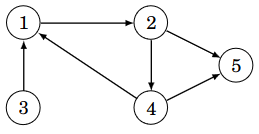
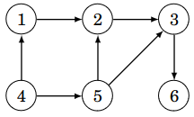
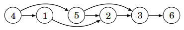
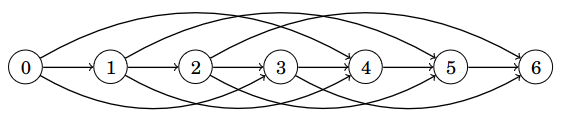
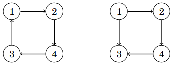
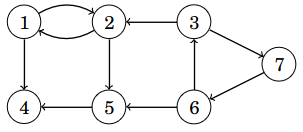
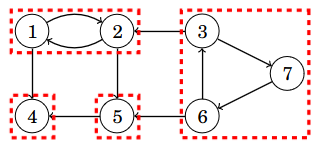
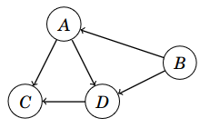

# 13. Directed graphs

Earlier we assumed that the edges of a graph go both directions, i.e, that the graph is _undirected_. For example, the following graphs is undirected:

Tähän mennessä olemme olettaneet, että verkon kaaria voi kulkea molempiin suuntiin eli verkko on _suuntaamaton_ (_undirected_). Esimerkiksi seuraava verkko on suuntaamaton:


In this chapter, we consider _directed_ graphs, where edges go only one direction, which is indicated by arrows on edges. For example, the following graph is directed:

Tässä luvussa tarkastelemme tilannetta, jossa verkko on _suunnattu_ (_directed_). Tällöin kaarissa on nuolet, jotka osoittavat, kumpaan suuntaan kaarta voi kulkea. Esimerkiksi seuraava verkko on suunnattu:



Dealing with directed graphs is similar to dealing with undirected graphs, but the edge directions do change some things. This chapter covers algorithms that are specifically designed for directed graphs.

Suunnattuja verkkoja voi käsitellä melko samalla tavalla kuin suuntaamattomia, mutta kaarten suunnat muuttavat joitakin asioita. Tutustumme tässä luvussa algoritmeihin, jotka liittyvät erityisesti suunnattujen verkkojen käsittelyyn.

## Representing directed graphs

In programming, a directed graph can represented using adjacency lists in the same way as undirected graphs, but each edge is added to only one adjacency list. The following class can used for directed graphs:

Suunnattu verkko voidaan esittää ohjelmoinnissa samaan tapaan vieruslistoina kuin suuntaamaton verkko, mutta kaaret lisätään verkkoon vain toiseen suuntaan. Seuraava luokka soveltuu suunnatun verkon esittämiseen:

```python
class Graph:
    def __init__(self, nodes):
        self.nodes = nodes
        self.graph = {node: [] for node in self.nodes}
        
    def add_edge(self, a, b):
        self.graph[a].append(b)
```

Since the graph is directed, the method `add_edge` adds the node `b` into the adjacency list of the node `a`, but it does not add the node `a` into the adjacency list of the node `b`. Thus the adjacency list contains only those nodes that can be reached by following an edge in the specified direction.

Now the above example graph can be created as follows:

Koska verkko on suunnattu, metodi `add_edge` lisää solmun `a` vieruslistalle solmun `b`, mutta se ei lisää solmun `b` vieruslistalle solmua `a`. Vieruslista siis sisältää solmut, joihin pääsee kulkemalla kaarta haluttuun suuntaan.

Nyt äskeinen esimerkkiverkko voidaan luoda näin:

```python
g = Graph([1, 2, 3, 4, 5])

g.add_edge(1, 2)
g.add_edge(2, 4)
g.add_edge(2, 5)
g.add_edge(3, 1)
g.add_edge(4, 1)
g.add_edge(4, 5)
```

Depth-first search and breadth-first search work on directed graphs too. Since they use the adjacency lists, edges are followed in one direction only during the search.

Suunnatun verkon käsittelyyn voidaan käyttää syvyyshakua ja leveyshakua samaan tapaan kuin suuntaamattoman verkon käsittelyyn. Koska kaaret on lisätty vain yhteen suuntaan, haut kulkevat verkossa kaarien suuntien mukaisesti.

## Topological ordering

A _topological ordering_ of a directed graph is an ordering of the nodes that satisfies the following condition: If there is a (directed) path from a node $$a$$ to a node $$b$$, then the node $$a$$ is before the node $$b$$ in the ordering.

Consider the following graph as an example:

Suunnatun verkon _topologinen järjestys_ (_topological sort_) on solmujen järjestys, joka toteuttaa seuraavan ehdon: jos solmusta $$a$$ pääsee solmuun $$b$$, niin solmu $$a$$ on ennen solmua $$b$$ järjestyksessä.

Tarkastellaan esimerkkinä seuraavaa verkkoa:



One possible topological ordering for the graph is $$[4,1,5,2,3,6]$$. In the following image, the nodes are displayed in the topological order, which makes all edges to go from left to right.

Yksi mahdollinen topologinen järjestys tälle verkolle on $$[4,1,5,2,3,6]$$. Seuraavassa kuvassa verkon solmut on aseteltu topologiseen järjestykseen, jolloin kaikki kaaret kulkevat vasemmalta oikealle.



A topological ordering exists only for graphs that contain no _cycle_, called _acyclic_ graphs. A cycle is a path in the graph that returns back to the node it started from. A cycle makes a topological ordering impossible, because no node of the cycle can occur in the ordering before all other nodes of the cycle.

_Directed acyclic graphs_ are useful in many applications. The abbreviation _DAG_ is sometimes used as short hand for directed acyclic graph.

Topologinen järjestys on mahdollista muodostaa, kun verkossa ei ole _sykliä_ (_cycle_) eli verkko on _syklitön_ (_acyclic_). Sykli on verkossa oleva polku, joka palaa takaisin lähtösolmuun. Sykli estää topologisen järjestyksen muodostamisen, koska mikään syklin solmuista ei voi esiintyä ennen muita järjestyksessä.

Suunnatut syklittömät verkot ovat käteviä monissa sovelluksissa. Niistä käytetään joskus englanniksi termiä _dag_, joka tulee sanoista _directed acyclic graph_.

### Topological sorting

A topological ordering can be computed using depth-first searches. During the computation, each node is in one of three states:

* State 0: the node has not been visited yet
* State 1: the processing of the node has started but is not finished yet
* State 2: the node has been fully processed

Topologinen järjestys voidaan muodostaa suorittamalla verkossa syvyyshakuja. Verkon solmuilla on kolme mahdollista tilaa muodostamisen aikana:

* Tila 0: haku ei ole vielä käynyt solmussa
* Tila 1: solmun käsittely on aloitettu
* Tila 2: solmun käsittely on saatu loppuun

Initially, every node is in state 0. The algorithm iterates through all nodes, and starts a depth-first search for each node that is still in state 0. When the search reaches a node, the state of the node changes to 1. When all the edges leaving the node have been processed, the state becomes 2.

The algorithm constructs a list of all the nodes of the graph. Each node is added to the list when it reaches the state 2. At the end of the algorithm, the list is reversed to obtain a topological ordering.

Algoritmin alussa jokaisen solmun tila on 0. Algoritmi käy läpi verkon solmut ja aloittaa syvyyshaun jokaisesta solmusta, jonka tila on 0. Kun haku saapuu solmuun, solmun tilaksi tulee 1. Kun haku on käynyt läpi kaikki solmusta lähtevät kaaret, solmun tilaksi tulee 2.

Algoritmi muodostaa listan, joka sisältää verkon solmut. Kukin solmu lisätään listalle siinä vaiheessa, kun solmun tilaksi tulee 2. Algoritmin päätteeksi tämä lista käännettynä ympäri on yksi verkon topologinen järjestys.

If the graph contains a cycle, this is detected by the algorithm when it encounters an edge that leads to a node in state 1. Such a situation occurs only with a cycle and indicates that there is no topological ordering.

An implemenation of the algorithm in Python follows:

Jos verkossa on sykli, tämä havaitaan algoritmin aikana siitä, että haku päätyy kaarta pitkin solmuun, jonka tilana on 1. Tällöin verkossa on sykli eikä topologisen järjestyksen muodostaminen ole mahdollista.

Seuraavassa on algoritmin toteutus Pythonilla:

```python
class TopologicalSort:
    def __init__(self, nodes):
        self.nodes = nodes
        self.graph = {node: [] for node in self.nodes}
        
    def add_edge(self, a, b):
        self.graph[a].append(b)
        
    def visit(self, node):
        if self.state[node] == 1:
            self.cycle = True
            return
        if self.state[node] == 2:
            return

        self.state[node] = 1
        for next_node in self.graph[node]:
            self.visit(next_node)

        self.state[node] = 2
        self.order.append(node)
        
    def create(self):
        self.state = {}
        for node in self.nodes:
            self.state[node] = 0

        self.order = []
        self.cycle = False
        
        for node in self.nodes:
            if self.state[node] == 0:
                self.visit(node)
                
        if self.cycle:
            return None
        else:
            self.order.reverse()
            return self.order        
```

The algorithm can be used as follows:

Algoritmia voidaan käyttää näin:

```python
t = TopologicalSort([1, 2, 3, 4, 5, 6])

t.add_edge(1, 2)
t.add_edge(2, 3)
t.add_edge(3, 6)
t.add_edge(4, 1)
t.add_edge(4, 5)
t.add_edge(5, 2)
t.add_edge(5, 3)

print(t.create()) # [4, 5, 1, 2, 3, 6]
```

Notice that the topological ordering computed by the algorithm, $$[4,5,1,2,3,6]$$, is different from the earlier example topological ordering $$[4,1,5,2,3,6]$$. This is because a graph can have multiple topological orders and the algorithm finds one of them.

Huomaa, että algoritmin antama topologinen järjestys $$[4,5,1,2,3,6]$$ on eri kuin aiemmin esimerkkinä ollut topologinen järjestys $$[4,1,5,2,3,6]$$. Tämä johtuu siitä, että verkolla voi olla useita topologisia järjestyksiä ja algoritmi löytää yhden niistä.

### Why does the algorithm work correctly?

The correctness of the algorithm is based on the fact that, if the graph has en edge from a node $$a$$ to a node $$b$$, the node $$a$$ reaches state 2 later than the node $$b$$. Thus the node $$a$$ is added to the list later than the node $$b$$.

Since the list is reversed at the end, the node $$a$$ is before $$b$$ in the computed ordering. This ensures that the edge goes from left to right in the ordering.

If the graph contains a cycle, at some point the algorithm reaches one of the nodes in the cycle. Following the edges out of the node will lead back to the node itself along the cycle before the node changes to state 2, which is detected by the algorithm.

Algoritmin toiminnan voi perustella sillä, että kun verkossa on kaari solmusta $$a$$ solmuun $$b$$, solmun $$a$$ tilaksi tulee 2 myöhemmin kuin solmun $$b$$ tilaksi tulee 2. Niinpä algoritmi lisää solmun $$a$$ listaan myöhemmin kuin solmun $$b$$.

Tämän ansiosta kun lista käännetään lopuksi, solmu $$a$$ on topologisessa järjestyksessä ennen solmua $$b$$. Tämä takaa, että kaikki kaaret kulkevat vasemmalta oikealle topologisessa järjestyksessä.

Jos verkossa on sykli, haku päätyy jossain vaiheessa johonkin syklissä olevista solmuista ja kulkee kaaria eteenpäin niin, että se päätyy uudestaan samaan solmuun. Niinpä algoritmi onnistuu tunnistamaan tilanteen, jossa verkossa on sykli.

## Dynamic programming

Dynamic programming can be used for computing with directed acyclic graphs. For example, the following questions can be answered using dynamic programming:

* How many different paths are there from a node $$a$$ to a node $$b$$?
* What is the smallest number of edges on a path from a node $$a$$ to a node $$b$$?
* What is the largest number of edges on a path from a node $$a$$ to a node $$b$$?

As an example, consider path counting in the following graph:

Suunnattujen syklittömien verkkojen käsittelyyn voidaan käyttää dynaamista ohjelmointia. Dynaamisella ohjelmoinnilla voidaan vastata esimerkiksi seuraaviin polkuihin liittyviin kysymyksiin:

* Montako erilaista polkua on solmusta $$a$$ solmuun $$b$$?
* Mikä on pienin määrä kaaria polulla solmusta $$a$$ solmuun $$b$$?
* Mikä on suurin määrä kaaria polulla solmusta $$a$$ solmuun $$b$$?

Kun verkossa ei ole syklejä, verkkoa voidaan käsitellä kätevästi dynaamisen ohjelmoinnin avulla. Tarkastellaan esimerkkinä polkujen määrän laskemista seuraavassa verkossa:


There are $$3$$ different paths from the node $$4$$ to the node $$3$$ in this graph:

Tässä verkossa on $$3$$ erilaista polkua solmusta $$4$$ solmuun $$3$$:

* $$4 \rightarrow 1 \rightarrow 2 \rightarrow 3$$ <span></span>
* $$4 \rightarrow 5 \rightarrow 2 \rightarrow 3$$ <span></span>
* $$4 \rightarrow 5 \rightarrow 3$$ <span></span>

When counting the paths from the node $$4$$ to the node $$3$$, we can divide the problem into two subproblems:

* The first edge of the path is $$4 \rightarrow 1$$. In this case, we then count the paths from the node $$1$$ to the node $$3$$.
* The first edge of the path is $$4 \rightarrow 5$$. In this case, we then count the paths from the node $$5$$ to the node $$3$$.

There is $$1$$ path from the node $$1$$ to the node $$3$$ and $$2$$ paths from the node $$5$$ to the node $$3$$. Thus the number of paths from the node $$4$$ to the node $$3$$ is $$1+2=3$$.

Kun halutaan laskea polut solmusta $$4$$ solmuun $$3$$, laskenta voidaan jakaa kahteen osaongelmaan:

* Polun ensimmäinen kaari on $$4 \rightarrow 1$$. Tässä tapauksessa lasketaan mukaan polut solmusta $$1$$ solmuun $$3$$.
* Polun ensimmäinen kaari on $$4 \rightarrow 5$$. Tässä tapauksessa lasketaan mukaan polut solmusta $$5$$ solmuun $$3$$.

Solmusta $$1$$ on $$1$$ polku solmuun $$3$$ ja solmusta $$5$$ on $$2$$ polkua solmuun $$3$$, joten polkuja solmusta $$4$$ solmuun $$3$$ on yhteensä $$1+2=3$$.

More generally, when counting paths from a node $$x$$ to a node $$y$$, we iterate through all nodes that are reacheable by an edge from the node $$x$$. Summing up all paths from such nodes to the node $$y$$ gives the number of paths from the node $$x$$ to the node $$y$$. When the graph has no cycles, all the subproblems can be computed efficiently using dynamic programming.

The following code implements the algorithm in Python:

Yleisemmin kun halutaan laskea polkujen määrä solmusta $$x$$ solmuun $$y$$, voidaan käydä läpi kaikki solmut, joihin pääsee kaarella solmusta $$x$$. Kun lasketaan yhteen kaikissa näissä solmuissa polkujen määrät solmuun $$y$$, saadaan tuloksena polkujen määrä solmusta $$x$$ solmuun $$y$$. Koska verkossa ei ole syklejä, määrät voidaan laskea dynaamisella ohjelmoinnilla.

Seuraava koodi toteuttaa algoritmin Pythonilla:

```python
class CountPaths:
    def __init__(self, nodes):
        self.nodes = nodes
        self.graph = {node: [] for node in self.nodes}
        
    def add_edge(self, a, b):
        self.graph[a].append(b)
        
    def count_from(self, node):
        if node in self.result:
            return self.result[node]
        
        path_count = 0
        for next_node in self.graph[node]:
            path_count += self.count_from(next_node)
        
        self.result[node] = path_count
        return path_count
        
    def count_paths(self, x, y):
        self.result = {y: 1}
        return self.count_from(x)
```

The algorithm can be used as follows:

Algoritmia voidaan käyttää näin:

```python
c = CountPaths([1, 2, 3, 4, 5, 6])

c.add_edge(1, 2)
c.add_edge(2, 3)
c.add_edge(3, 6)
c.add_edge(4, 1)
c.add_edge(4, 5)
c.add_edge(5, 2)
c.add_edge(5, 3)

print(c.count_paths(4, 3)) # 3
```

Here dynamic programming is realized by storing path counts from each node to the target node in a dictionary `result`. If the path count is already stored, it is not computed again, which makes the algorithm efficient.

Tässä dynaaminen ohjelmointi on toteutettu tallentamalla sanakirjaan `result` jokaisesta solmusta polkujen määrä kohdesolmuun. Jos polkujen määrä on jo laskettu, sitä ei lasketa uudestaan, minkä ansiosta algoritmi toimii tehokkaasti.

### Problems as graphs

Dynamic programming in general can be seen as operating on a directed acyclic graph. Consider the following task, which was solved using dynamic programming in Chapter 10:

Dynaaminen ohjelmointi voidaan yleensäkin nähdä suunnattujen syklittömien verkkojen käsittelynä. Tarkastellaan esimerkkinä seuraavaa tehtävää, joka ratkaistiin dynaamisella ohjelmoinnilla luvussa 10:

{: .note-title }
Task
<div class="note" markdown="1">

You have an unlimited number coins with values given as a list. How many ways can you choose the coins so that their sum is $$x$$?

For example, when the coins are $$[1,3,4]$$ and $$x=6$$, the number of ways is $$9$$:

Käytössäsi on rajaton määrä kolikkoja, joiden arvot annetaan listassa. Montako eri tapaa on muodostaa kolikoista summa $$x$$?

Esimerkiksi kun kolikot ovat $$[1,3,4]$$ ja $$x=6$$, tapoja on $$9$$:

* $$[1,1,1,1,1,1]$$<span></span>
* $$[1,1,1,3]$$<span></span>
* $$[1,1,4]$$<span></span>
* $$[1,1,3,1]$$<span></span>
* $$[1,3,1,1]$$<span></span>
* $$[1,4,1]$$<span></span>
* $$[3,1,1,1]$$<span></span>
* $$[3,3]$$<span></span>
* $$[4,1,1]$$<span></span>


</div>

This problem can be represented as a graph, where each node represents one of the sums $$0,1,\dots,x$$, and there is an edge from a node $$a$$ to a node $$b$$ if adding one coin to the sum $$a$$ gives the sum $$b$$. When the coins are $$[1,3,4]$$ ja $$x=6$$, the graph looks like this:

Tämä ongelma voidaan esittää verkkona, jossa jokainen solmu vastaa rahamäärää $$0,1,\dots,x$$ ja solmusta $$a$$ on kaari solmuun $$b$$, jos rahamäärästä $$a$$ pääsee yhdellä kolikolla rahamäärään $$b$$. Kun kolikot ovat $$[1,3,4]$$ ja $$x=6$$, verkko on seuraava:



Each path from the node $$0$$ to the node $$x$$ represents one way of obtaining the sum $$x$$. Thus the number of such paths is the number of ways choosing the coins. We could use above class `CountPaths` almost directly for solving the task.

Tässä verkossa jokainen polku solmusta $$0$$ solmuun $$x$$ tarkoittaa yhtä tapaa, miten rahamäärä voidaan muodostaa. Niinpä polkujen määrä solmusta $$0$$ solmuun $$x$$ on yhtä suuri kuin erilaisten tapojen määrä. Voisimme siis käyttää melkein suoraan äskeistä luokkaa `CountPaths` tehtävän ratkaisemiseen.

## Strong connectivity

In directed graphs, the concept of connectivity is more complicated than in undrected graphs, because two nodes are not necessarily connected by a directed path even if they are in the same component.

For example, consider the graphs in the following figure. In the graph on the left, there is a path from any node to any other node, but the graph on the right has no path from the node $$2$$ to the node $$1$$, for example.

Suunnatussa verkossa yhtenäisyyden käsite on mutkikkaampi kuin suuntaamattomassa verkossa, koska kahden solmun välillä ei ole välttämättä polkua, vaikka solmut olisivat samassa komponentissa.

Esimerkiksi seuraavassa kuvassa vasemmassa verkossa on polku mistä tahansa solmusta mihin tahansa solmuun, mutta oikeassa verkossa ei ole esimerkiksi polkua solmusta $$2$$ solmuun $$1$$.



A directed graph is _strongly connected_, if there is a directed path from any node to any other node. In the above figure, the graph on the left is strongly connected but the graph on the right is not.

The _strongly connected components_ of a directed graph are maximal sets on nodes such that there is a path from any node in the set to any other node in the set. Any directed graph can be partitioned into strongly connected components. Consider the following graph as an example:

Suunnattu verkko on _vahvasti yhtenäinen_ (_strongly connected_), jos mistä tahansa solmusta on polku mihin tahansa solmuun. Äskeisessä kuvassa vasen verkko on vahvasti yhtenäinen, kun taas oikea verkko ei ole vahvasti yhtenäinen.

Suunnatun verkon _vahvasti yhtenäinen komponentti_ (_strongly connected component_) on maksimaalinen joukko solmuja, jossa mistä tahansa solmusta on polku mihin tahansa solmuun. Verkko voidaan jakaa aina vahvasti yhtenäisiin komponentteihin. Tarkastellaan esimerkkinä seuraavaa verkkoa:



The strongly connected components of this graph are:

Tässä tapauksessa vahvasti yhtenäiset komponentit ovat:



The following figure shows the strongly connected components as a graph, where each node corresponds to one component:

Seuraava kuva esittää vahvasti yhtenäiset komponentit verkkona, jossa jokainen solmu vastaa yhtä komponenttia:



Here the components are $$A=\{1,2\}$$, $$B=\{3,6,7\}$$, $$C=\{4\}$$ and $$D=\{5\}$$. 

Such a graph of components is always acyclic and reveals the connectivity structure of the graph, i.e., which nodes have a path between them.

Tässä komponentit ovat $$A=\{1,2\}$$, $$B=\{3,6,7\}$$, $$C=\{4\}$$ ja $$D=\{5\}$$.

Tällainen komponenteista muodostuva verkko on aina syklitön ja se tuo näkyviin verkon syvärakenteen eli miten verkossa pystyy liikkumaan solmuista toisiinsa.

### Kosaraju's algorithm

The strongly connected components of a graph can be computed using Kosaraju's algorithm. The has two phases, each of which visits all nodes using depth-first search.

The first phase constructs a list of all nodes in the same way as in topological sorting. The difference is that the algorithm does not keep track of the states of the nodes and does not check for cycles.

The second phase is performed in the _transpose_ graph, where the direction of every edge has been reversed. The algorithm iterates through the node list constructed in the first phase in reverse order, and starts a depth-first search for each node that has not been visited yet. For each such depth-first search, the nodes visited during the search form a strongly connected component.

The algorithm can be implemented as follows in Python:

Verkon vahvasti yhtenäiset komponentit voidaan etsiä tehokkaasti Kosarajun algoritmilla. Algoritmi etsii komponentit kahdessa vaiheessa, joissa se käy läpi verkon solmut syvyyshaun avulla.

Algoritmin ensimmäinen vaihe luo listan solmuista samalla tavalla kuin topologisen järjestyksen muodostamisessa. Erona on kuitenkin, että algoritmi ei pidä muistissa solmujen tiloja eikä välitä verkossa mahdollisesti olevista sykleistä.

Algoritmin toinen vaihe suoritetaan _käänteisessä_ verkossa, jossa jokaisen kaaren suunta on käänteinen. Algoritmi käy läpi ensimmäisessä vaiheessa muodostetun solmujen listan käänteisessä järjestyksessä ja aloittaa haun jokaisesta solmusta, jota ei ole vielä käsitelty. Jokainen tällainen haku muodostaa yhden vahvasti yhtenäisen komponentin.

Algoritmi voidaan toteuttaa Pythonilla seuraavasti:

```python
class Kosaraju:
    def __init__(self, nodes):
        self.nodes = nodes
        self.graph = {node: [] for node in self.nodes}
        self.reverse = {node: [] for node in self.nodes}
        
    def add_edge(self, a, b):
        self.graph[a].append(b)
        self.reverse[b].append(a)
        
    def visit(self, node, phase):
        if node in self.visited:
            return
        self.visited.add(node)

        if phase == 1:
            graph = self.graph
        if phase == 2:
            graph = self.reverse
        
        for next_node in graph[node]:
            self.visit(next_node, phase)

        if phase == 1:
            self.order.append(node)
        
    def count_components(self):
        self.visited = set()
        self.order = []
        
        for node in self.nodes:
            self.visit(node, 1)
                
        self.order.reverse()
        self.visited.clear()

        count = 0
        for node in self.order:
            if node not in self.visited:
                count += 1
                self.visit(node, 2)
                
        return count
```

The algorithm can be used as follows:

Algoritmia voidaan käyttää näin:

```python
k = Kosaraju([1, 2, 3, 4, 5, 6, 7])

k.add_edge(1, 2)
k.add_edge(1, 4)
k.add_edge(2, 1)
k.add_edge(2, 5)
k.add_edge(3, 2)
k.add_edge(3, 7)
k.add_edge(5, 4)
k.add_edge(6, 3)
k.add_edge(6, 5)
k.add_edge(7, 6)

print(k.count_components()) # 4
```

Here the method `count_components` counts the number of strongly connected components. In the example graph, the algorithm finds $$4$$ strongly connected components.

Tässä metodi `count_components` laskee vahvasti yhtenäisten komponenttien määrän. Esimerkkiverkossa metodi löytää $$4$$ vahvasti yhtenäistä komponenttia.

### Why the algorithm works correctly?

During the second phase of Kosaraju's algorithm, each depth-first search visits all nodes that are reachable from the start node and have not been visited before. How do we know that the set of visited nodes forms exactly one strongly connected component and does not contain nodes from other components?

Consider an edge $$a \rightarrow b$$ in the original graph that goes from one component to another component. In the first phase, the nodes in the component of the node $$b$$ are added to the list before the nodes in the component of the node $$a$$. In the reversed list the order is the opposite, and thus the second phase constructs the component of the node $$a$$ before the component of the node $$b$$. Since the edges have been reversed, the edge $$a \rightarrow b$$ has become the edge $$b \rightarrow a$$, which prevents the search for the component of the node $$a$$ from spilling into the component of the node $$b$$.

Since the above deduction works for any edge that goes from one component to another, no depth-first search in the second phase visits nodes in other components.

Kosarajun algoritmin toisessa vaiheessa syvyyshaku lisää vahvasti yhtenäiseen komponenttiin kaikki solmut, joihin pääsee alkusolmusta ja joita ei ole vielä lisätty toiseen komponenttiin. Miten on varmaa, että tuloksena on vahvasti yhtenäinen komponentti eikä siihen tule ylimääräisiä solmuja?

Tarkastellaan jotain alkuperäisen verkon kaarta $$a \rightarrow b$$, joka johtaa vahvasti yhtenäisestä komponentista toiseen. Solmun $$b$$ komponentin solmut lisätään listalle ennen solmun $$a$$ komponentin solmuja, joten käänteisessä verkossa solmun $$a$$ komponentin solmut ovat ennen solmun $$b$$ komponentin solmuja. Algoritmin toisessa vaiheessa solmun $$a$$ komponentti muodostetaan ensin. Koska kaaret on käännetty, kaaresta $$a \rightarrow b$$ on tullut kaari $$b \rightarrow a$$, minkä ansiosta solmun $$a$$ komponentista ei ajauduta solmun $$b$$ komponenttiin.

Koska yllä oleva päättely toimii kaikissa kaarissa, jotka johtavat komponentista toiseen, algoritmi muodostaa komponentit oikein eikä niihin tule ylimääräisiä solmuja.

