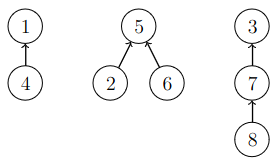
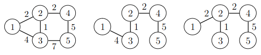

# 15. Components and spanning trees

The graph algorithm we have seen so far compute their results by visiting all nodes and edges of the graph. Such algorithms are slow, however, when the graph keeps changing frequently.

In this chapter, we will learn about _union-find data structure_ that maintains information about the components of a graph as edges are added to the graph. For example, we can efficiently find if two nodes are in the same component, or how many components the graph has.

We will also see the Kruskal algorithm that uses the union-find data structure for computing the minimum spanning tree. A _spanning tree_ of a graph is a subset of the edges that connects all nodes.

Tähän mennessä olemme käsitelleet verkkoalgoritmeja, jotka laskevat jotain käymällä läpi verkon kaikki solmut ja kaaret. Tällaiset algoritmit ovat kuitenkin hitaita tilanteessa, jossa verkkoon tulee jatkuvasti muutoksia.

Tässä luvussa tutustumme union-find-rakenteeseen, jonka avulla voidaan pitää tehokkaasti yllä tietoa verkon komponenteista, kun verkkoon lisätään kaaria. Voimme esimerkiksi selvittää tehokkaasti, ovatko solmut samassa komponentissa tai montako komponenttia verkossa on.

Tutustumme myös Kruskalin algoritmiin, joka käyttää union-find-rakennetta verkon pienimmän virittävän puun muodostamiseen. Virittävä puu on verkon kaarten osajoukko, joka yhdistää kaikki verkon solmut toisiinsa.

## Union-find data structure

A union-find data structure maintains a collections of elements divided into subsets. Initially each element is alone in its own set, and then the sets can be repeatedly merged into bigger sets. The data structure supports two efficient operations:

* find: Find which set contains a given element
* union: Merge two sets into a single set

A union-find data structure is implemented so that one element in each set represents the whole set.  All other elements in the set have a reference to the representative element either directly or indirectly through other elements in the set. By following the references, we can find the representative element of the set containing a given element.

Union-find-rakenne on tietorakenne, joka pitää yllä kokoelmaa alkioista. Aluksi jokainen alkio on omassa joukossaan, ja joukkoja voidaan yhdistää. Tietorakenne tarjoaa kaksi tehokasta operaatiota:

* Määritä, mihin joukkoon alkio kuuluu
* Yhdistä kaksi joukkoa samaksi joukoksi

Union-find-rakenne on toteutettu niin, että jokaisessa joukossa yksi alkioista on joukon edustaja. Kaikista muista joukon alkioista on viittaus edustajaan suoraan tai muiden alkioiden kautta. Näiden viittausten avulla voidaan selvittää sen joukon edustaja, johon tietty alkio kuuluu.

As an example, consider a union-find structure for the elements $$1,2,\dots,8$$. In the following figure, the sets are $$\{1,4\}$$, $$\{2,5,6\}$$ and $$\{3,7,8\}$$:

Tarkastellaan esimerkkinä union-find-rakennetta, joka sisältää alkiot $$1,2,\dots,8$$. Seuraavassa kuvassa joukot ovat $$\{1,4\}$$, $$\{2,5,6\}$$ sekä $$\{3,7,8\}$$:



Here the representatives of the sets are $$1$$, $$5$$ and $$3$$. For any other element, the chain of references leads to one of the representatives. For example, the path from the element $$2$$ to the representative of its set is $$2 \rightarrow 5$$, and the path from the element $$8$$ to the representative of its set is
$$8 \rightarrow 7 \rightarrow 3$$.

Two elements belong to the same set if they have the same representative. For example, the elements $$2$$ and $$6$$ are in the same set, because the representive of both is $$5$$. Conversely, the elements $$2$$ and $$3$$ belong to different sets, because the representative of the element $$2$$ is $$5$$ and the representative of the element $$3$$ is $$3$$.

When two sets are merged, the reference from one of their representatives is set to point to the other representative, which then becomes the representative of the new set. For example, the following figure shows how the sets $$\{1,4\}$$ and $$\{2,5,6\}$$ can be merged:

Tässä joukkojen edustajat ovat $$1$$, $$5$$ ja $$3$$. Kaikista muista alkioista päästään viittausten avulla edustajiin. Esimerkiksi alkiosta $$2$$ päästään edustajaan polkua $$2 \rightarrow 5$$ ja alkiosta $$8$$ päästään edustajaan polkua $$8 \rightarrow 7 \rightarrow 3$$.

Kaksi alkiota kuuluvat samaan joukkoon, jos niillä on yhteinen edustaja. Esimerkiksi solmut $$2$$ ja $$6$$ kuuluvat samaan joukkoon, koska molempien joukkojen edustaja on $$5$$. Solmut $$2$$ ja $$3$$ puolestaan kuuluvat eri joukkoihin, koska solmun $$2$$ joukon edustaja on $$5$$ ja solmun $$3$$ joukon edustaja on $$3$$.

Kun kaksi joukkoa yhdistetään, toisen joukon edustaja asetetaan viittaamaan toisen joukon edustajaan, josta tulee koko uuden joukon edustaja. Esimerkiksi seuraava kuva näyttää, miten joukot $$\{1,4\}$$ ja $$\{2,5,6\}$$ voidaan yhdistää:


Here the representative $$1$$ of the set $$\{1,4\}$$ is set to reference the element $$5$$, which is the representative of the set $$\{2,5,6\}$$. Afterwards, there is a new set $$\{1,2,4,5,6\}$$ with the representative $$5$$, and the old sets $$\{1,4\}$$ and $$\{2,5,6\}$$ exist no more. For example, the path from the element $$4$$ to its representative is now $$4 \rightarrow 1 \rightarrow 5$$.

Tässä joukon $$\{1,4\}$$ edustaja $$1$$ asetetaan viittaamaan joukon $$\{2,5,6\}$$ edustajaan $$5$$. Tämän seurauksena syntyy uusi joukko $$\{1,2,4,5,6\}$$, jonka edustaja on $$5$$. Yhdistämisen jälkeen kaikista uuden joukon alkioista pääsee polkua pitkin joukon edustajaan $$5$$. Esimerkiksi alkiosta $$4$$ päästään edustajaan polkua $$4 \rightarrow 1 \rightarrow 5$$.

The efficiency of the union-find data structure depends on how fast the representative of a given element can be found. The shorter the reference paths are, the faster the representatives can be found. The paths can be kept short by implementing the merging a specific way.

When two sets are merged, there are two choices for the representative of the new set. For efficiency, the better choice is the representative of the _larger_ of the old sets. This ensures that the length of every path is $$O(\log n)$$, and then the representative of any element can be found efficiently.

The union-find data structure can be implemented as follows:

Union-find-rakenteen tehokkuus riippuu siitä, miten nopeasti tietyn alkion edustaja voidaan löytää. Mitä lyhempiä viittausten muodostamat polut ovat, sitä tehokkaammin edustajat voidaan löytää. Polkujen pituutta voidaan rajata toteuttamalla joukkojen yhdistämiset niin, että ne eivät tuota pitkiä polkuja.

Kun kaksi joukkoa yhdistetään, on kaksi tapaa valita, kumman joukon edustaja alkaa viitata toisen joukon edustajaan. Tehokkuuden kannalta hyvä valinta on, että _pienemmän_  joukon edustaja alkaa viitata _suuremman_ joukon edustajaan. Tällöin jokaisen polun pituus on luokkaa $$O(\log n)$$ ja minkä tahansa solmun edustaja voidaan löytää tehokkaasti.

Union-find-rakenne voidaan toteuttaa seuraavasti:

```python
class UnionFind:
    def __init__(self, nodes):
        self.link = {node: None for node in nodes}
        self.size = {node: 1 for node in nodes}

    def find(self, x):
        while self.link[x]:
            x = self.link[x]
        return x

    def union(self, a, b):
        a = self.find(a)
        b = self.find(b)
        if a == b: return

        if self.size[a] > self.size[b]:
            a, b = b, a
        self.link[a] = b
        self.size[b] += self.size[a]
```

The dictionary `link` stores the references from the elements. The reference of a representative element has the value `None`. The dictionary `size` stores the size of the set for each representative element.

The method `find` follows the chain of references until it reaches a representative element. The method `union` merges the sets containing the elements `a` and `b`. First, the method finds the representatives of the sets. If the elements are already in the same set, the method does nothing. Otherwise, the method sets the reference from the representative of the smaller set to the representative of the larger set, and updates the size for the representative of the new set.

The following code demonstrates the use of the class:

Sanakirja `link` ilmoittaa kustakin solmusta, mihin solmuun se viittaa. Jos solmu ei viittaa mihinkään, viittauksen kohdalla on `None`. Sanakirja `size` puolestaan kertoo jokaisen joukon edustajasolmulle, kuinka suuri kyseinen joukko on.

Metodi `find` etsii solmun `x` edustajan kulkemalla viittausten muodostamaa polkua. Metodi `union` yhdistää joukot, joihin kuuluvat solmut `a` ja `b`. Metodi etsii ensin joukkojen edustajat. Jos solmut ovat jo samassa joukossa, metodi ei tee mitään. Muuten metodi asettaa pienemmän joukon edustajan viittaamaan suuremman joukon edustajaan ja päivittää suuremman joukon edustajaan liittyvän koon.

Seuraava koodi esittelee luokan käyttämistä:

```python
u = UnionFind([1, 2, 3, 4, 5, 6, 7, 8])

u.union(1, 4)
u.union(2, 5)
u.union(5, 6)
u.union(3, 7)
u.union(7, 8)

print(u.find(1)) # 4
print(u.find(2)) # 5
print(u.find(3)) # 7
print(u.find(4)) # 4
print(u.find(5)) # 5
print(u.find(6)) # 5
print(u.find(7)) # 7
print(u.find(8)) # 7
```

Here the representative of the set $$\{1,4\}$$ is $$4$$, the representative of the set $$\{2,5,6\}$$ is $$5$$ and the representative of the set $$\{3,7,8\}$$ is $$7$$.

Tässä tapauksessa joukon $$\{1,4\}$$ edustaja on $$4$$, joukon $$\{2,5,6\}$$ edustaja on $$5$$ ja joukon $$\{3,7,8\}$$ edustaja on $$7$$.

## Example: New roads

{: .note-title }
Task
<div class="note" markdown="1">

Bitland has $$n$$ cities but initially no roads. Your task is to design a class `NewRoads` with the following methods:

* `add_road`: Adds a road between two cities.
* `has route`: checks if there is two cities are connected by roads.

Both methods should be efficient.

Bittimaassa on $$n$$ kaupunkia mutta ei vielä yhtään tietä. Tehtäväsi on laatia luokka `NewRoads`, jossa on seuraavat metodit:

* `add_road`: lisää tien kahden kaupungin välille
* `has_route`: tarkastaa, pystyykö kahden kaupungin välillä matkustamaan teitä pitkin

Kummankin metodin tulee toimia tehokkaasti.

</div>

The task can be solved efficiently using the union-find data structure:

Tehtävä voidaan ratkaista seuraavasti union-find-rakenteen avulla:

```python
class NewRoads:
    def __init__(self, n):
        self.uf = UnionFind(range(1, n + 1))

    def add_road(self, a, b):
        self.uf.union(a, b)

    def has_route(self, a, b):
        return self.uf.find(a) == self.uf.find(b)
```

The idea is that the sets of the union-find data structure correspond to the components of the road network. Initially, each element is in its own set of size one, which means that each node is in its own component of size one.

The method `add_road` calls the method `union` that merges the components of the graph. The method `has_route` calls the method `find` for each element. The elements belong to the same component if the method `find` returns the same representative for both elements.

In this solution, the time complexity of both the method `add_road` and the method `has_route` is $$O(\log n)$$.

Ideana on, että union-find-rakenteen joukot vastaavat verkon komponentteja. Aluksi jokainen alkio on omassa joukossaan, mikä tarkoittaa, että jokainen solmu on omassa komponentissaan.

Metodi `add_road` kutsuu metodia `union`, joka yhdistää verkon komponentit. Metodi `has_route` puolestaan kutsuu kummallekin alkiolle metodia `find`. Alkiot kuuluvat samaan komponenttiin, jos `find` antaa niille saman edustajan.

Tässä ratkaisussa kummankin metodin `add_road` ja `has_route` aikavaativuus on $$O(\log n)$$.

## Trees in graphs

An undirected graph is a _tree_, if the graph is connected and acyclic. For example, the following graph is a tree:

Suuntaamaton verkko on _puu_ (_tree_), jos verkko on yhtenäinen ja syklitön. Esimerkiksi seuraava verkko on puu:


Unlike the trees we have seen previously, this kind of a tree has no root, and the nodes have no children or parents. However, the tree has leaves: The leaves are the nodes with exactly one connecting edge. For example, the leaves of the above tree are $$1$$, $$2$$ and $$5$$.

When a graph of $$n$$ nodes is a tree, it has exactly $$n-1$$ edges. If any edge is removed from a tree, it is no longer connected. If a new edge is added to a tree, it is no longer acyclic.

A _spanning tree_ of a graph is a tree that contains all the nodes of the graph and some subset of the edges. The following figure shows a graph on the left, and one of the spanning trees of the graph on the right:

Toisin kuin aiemmin tällä kurssilla käsitellyissä puissa,
tässä tapauksessa puussa ei ole juurta eikä solmuilla ole lapsia eikä vanhempia. Kuitenkin puussa on lehtiä: lehtiä ovat kaikki solmut, joiden aste on $$1$$ eli joihin liittyy vain yksi kaari. Esimerkiksi yllä olevassa puussa lehtiä ovat solmut $$1$$, $$2$$ ja $$5$$.

Kun verkko on puu ja siinä on $$n$$ solmua, siinä on aina tasan $$n-1$$ kaarta. Jos puusta poistetaan kaari, se ei ole enää yhtenäinen. Jos taas puuhun lisätään kaari, se ei ole enää syklitön.

Verkon _virittävä puu_ (_spanning tree_) on puu, joka sisältää verkon solmut ja jonkin osajoukon sen kaarista. Seuraavassa kuvassa on vasemmalla verkko ja oikealla yksi sen virittävistä puista:


Typically a graph has multiple different spanning trees, because there are multiple ways of choosing the edges so that the result is a tree.

When the graph is weighted, the weight of a spanning tree is computed as the sum of the weights of its edged. As an example, the following figure shows a weighted graph and two of its spanning trees:

Verkolle voidaan muodostaa yleensä useita erilaisia virittäviä puita, koska on monia tapoja valita kaaria niin, että tuloksena on puu.

Kun verkko on painotettu, virittävän puun paino saadaan laskemalla yhteen puuhun valittujen kaarten painot. Tarkastellaan esimerkkinä seuraavaa kuvaa, jossa on painotettu verkko ja kaksi sen virittävää puuta:



The weight of the first spanning tree is $$4+1+2+5=12$$, and the weight of the second spanning tree is $$2+1+2+5=10$$.

In this case, the second spanning tree is a _minimum spanning tree_ of the graph. i.e., a spanning tree with the smallest possible weight. There can be multiple minimum spanning trees.

Ensimmäisen virittävän puun paino on $$4+1+2+5=12$$, ja toisen virittävän puun paino on $$2+1+2+5=10$$.

Tässä tapauksessa toinen virittävä puu on verkon _pienin virittävä puu_ (_minimum spanning tree_) eli virittävä puu, jonka paino on pienin mahdollinen. Myös pienimmän virittävän puun valintaan voi olla useita mahdollisuuksia.

## Kruskal's algorithm

Kruskal's algorithm computes a minimum spanning tree of a graph with the help of a union-find data structure. The algorithm goes through the edges in order of weight, and selects an edge to be included in the spanning tree, if adding it does not create a cycle in the tree.

For the above example graph, the algorithm goes through the edges as follows:

Kruskalin algoritmi on union-find-rakennetta käyttävä algoritmi, jolla voidaan muodostaa verkon pienin virittävä puu. Algoritmi käy läpi verkon kaaret painojärjestyksessä ja valitsee virittävään puuhun mukaan kaikki kaaret, jotka eivät aiheuta sykliä.

Esimerkiksi äskeisen verkon tapauksessa algoritmi käy läpi kaaret seuraavassa järjestyksessä:

Edge | Weight | Included in the tree?
$$2-3$$ | $$1$$ | Yes
$$1-2$$ | $$2$$ | Yes
$$2-4$$ | $$2$$ | Yes
$$1-3$$ | $$4$$ | No
$$4-5$$ | $$5$$ | Yes
$$3-5$$ | $$7$$ | No

The algorithm first adds the edges $$2-3$$, $$1-2$$ and $$2-4$$ to the tree. The edge $$1-3$$ is excluded, because adding it would create a cycle. Then the edge $$4-5$$ is still added to the tree, after which the tree is complete.

If two edges have the same weight, Kruskal's algorithm can process them in either order.

The union-find data structure is useful for Kruskal's algorithm, because it can be used for efficiently checking if an edge should be included or excluded. If the nodes connected by the edge are in different components, adding the edge does not create a cycle.

The following code implements Kruskal's algorithm:

Algoritmi ottaa mukaan puuhun ensin kaaret $$2-3$$, $$1-2$$ ja $$2-4$$. Kaari $$1-3$$ ei tule mukaan, koska se aiheuttaisi syklin. Sitten mukaan tulee vielä kaari $$4-5$$, jonka lisäämisen jälkeen pienin virittävä puu on valmis.

Jos kahdella kaarella on sama paino, Kruskalin algoritmi voi käsitellä ne kummassa tahansa järjestyksessä.

Kruskalin algoritmi voidaan toteuttaa tehokkaasti union-find-rakenteen avulla, koska sen avulla voidaan tarkastaa, tuleeko kaari lisätä mukaan virittävään puuhun. Jos kaaren päissä olevat solmut ovat eri komponenteissa, kaari lisätään virittävään puuhun eikä se aiheuta sykliä.

Seuraava luokka toteuttaa Kruskalin algoritmin:

```python
class Kruskal:
    def __init__(self, nodes):
        self.nodes = nodes
        self.edges = []

    def add_edge(self, node_a, node_b, weight):
        self.edges.append((node_a, node_b, weight))

    def construct(self):
        self.edges.sort(key=lambda x: x[2])

        uf = UnionFind(self.nodes)
        edges_count = 0
        tree_weight = 0

        for edge in self.edges:
            node_a, node_b, weight = edge
            if uf.find(node_a) != uf.find(node_b):
                uf.union(node_a, node_b)
                edges_count += 1
                tree_weight += weight

        if edges_count != len(self.nodes) - 1:
            return None
        return tree_weight
```

The method `construct` computes the minimum spanning tree and returns its the weight. The method first sorts the edge list by weight. Then the method iterates through the edges and selects the edges for the tree using a union-find data structure. When an edge is selected, its weight is added to the weight of the tree.

If a graph is not connected, it has no spanning tree. To detect this, the method counts the edges included in the tree. If the count at the end is less than $$n-1$$, the selected edges do not form a tree, which means that the graph is not connected. In this case, the method returns `None`.

The method can be used as follows:

Metodi `construct` muodostaa pienimmän virittävän puun ja palauttaa puun painon. Metodi järjestää ensin kaarilistan kaarten painojen mukaan. Tämän jälkeen metodi käy läpi kaaret ja valitsee kaaret puuhun union-find-rakenteen avulla. Kun kaari valitaan puuhun, sen paino lisätään puun painoon.

Virittävä puu on mahdollista muodostaa vain, kun verkko on yhtenäinen. Tämän vuoksi metodi pitää myös kirjaa siitä, montako kaarta on lisätty puuhun. Jos lopussa kaarten määrä on pienempi kuin $$n-1$$, verkko ei ole yhtenäinen eikä puuta voinut muodostaa. Tällöin metodi palauttaa arvon `None`.

Luokkaa voidaan käyttää seuraavasti:

```python
k = Kruskal([1, 2, 3, 4, 5])

k.add_edge(1, 2, 2)
k.add_edge(1, 3, 4)
k.add_edge(2, 3, 1)
k.add_edge(2, 4, 2)
k.add_edge(3, 5, 7)
k.add_edge(4, 5, 5)

print(k.construct()) # 10
```

### Why the algorithm works correctly?

Kruskal's algorithm constructs the spanning tree greedily based on the weight order. Why does this always produce a minimum spanning tree?

Consider a situation, where the edge $$a-b$$ is the next edge to be processed, and the nodes $$a$$ and $$b$$ are in different components. If the edge $$a-b$$ is not selected, then there must be another edge selected later that joins two components containing the nodes $$a$$ and $$b$$.

If we replace that later edge with the edge $$a-b$$, the spanning tree remains a spanning tree. Since the weight of that later edge is the same or greater than the weight of the edge $$a-b$$, the replacement does not increase the weight of the spanning tree. Thus selecting the edge $$a-b$$ is safe.

Kruskalin algoritmi muodostaa virittävän puun ahneesti kaarten painojärjestyksen perusteella. Miksi algoritmi tuottaa varmasti pienimmän virittävän puun?

Tarkastellaan tilannetta, jossa seuraavana järjestyksessä oleva kaari on $$a-b$$ ja solmut $$a$$ ja $$b$$ ovat eri komponenteissa. Jos kaarta $$a-b$$ ei valita puuhun, täytyy valita myöhemmin jokin toinen kaari, joka liittää solmut $$a$$ ja $$b$$ samaan komponenttiin.

Kuitenkin myöhemmin valittu kaari voidaan korvata kaarella $$a-b$$ niin, että tuloksena on edelleen virittävä puu. Koska myöhemmin valitun kaaren paino on yhtä suuri tai suurempi kuin kaaren $$a-b$$ paino, tämä ei lisää virittävän puun painoa. Niinpä on turvallista valita kaari $$a-b$$ puuhun.

## Minimizing vs. maximizing

Minimizing and maximizing something related to graphs can be very different problems. For example, the shortest path between two nodes can be found using the algorithms in Chapter 14, but how can we find the _longest_ path that visits each node at most once?

One approach that we could try is to negate the edge weights and then use one the shortest path algorithms. However, this may not work, because the negation can create negative cycles, which none of the algorithms can handle. In fact, no efficient algorithm is known for the longest path problem.

With spanning trees, however, this approach works: To find the _maximum_ spanning tree, we can negate the edge weights and then find the minimum spanning tree. With Kruskal's algorithm, the same effect can be achieved by processing the edges in the reverse order of weight.

Verkkojen käsittelyssä minimointi ja maksimointi voivat olla hyvin erilaisia ongelmia. Esimerkiksi lyhin polku kahden verkon solmun välillä voidaan etsiä luvun 14 algoritmeilla, mutta miten voitaisiin löytää _pisin_ polku, joka käy enintään kerran kussakin solmussa?

Mahdollinen tapa etsiä pisin polku olisi muuttaa kaikki kaarten painot negatiivisiksi ja etsiä uudessa verkossa lyhin polku. Tämä ei ole kuitenkaan toimiva tapa, koska uudessa verkossa voisi olla negatiivisia syklejä eivätkä algoritmit pystyisi käsittelemään sitä. Itse asiassa pisimmän polun etsimiseen ei tunneta mitään tehokasta algoritmia.

Virittävien puiden etsimisessä tilanne on kuitenkin toinen, koska _suurin_ virittävä puu (eli virittävä puu, jonka paino on suurin mahdollinen) on helppoa muodostaa muuttamalla kaarten painot negatiivisiksi ja rakentamalla pienin virittävä puu uudessa verkossa. Sama tulos saadaan muuttamalla Kruskalin algoritmia niin, että kaaret käydään läpi käänteisessä painojärjestyksessä.
