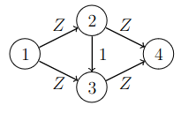

# 16. Maximum flow

In this chapter, we take a look at the problem of finding a _flow_ from a _source_ node to a _sink_ node in a directed graph. Each edge in the graph has a _capacity_ that tells how much flow the edge can carry.

The flow must be constructed so that the total flow leaving the source node is the same as the total flow going into the sink node, and for every other node the incoming flow is the same as the outgoing flow. The flow through an edge cannot exceed the capacity of the edge.

Tämän luvun tavoitteena on muodostaa suunnatussa verkossa _virtaus_ (_flow_) alkusolmusta (_source_) loppusolmuun (_sink_). Jokaisella verkon kaarella on _kapasiteetti_ (_capacity_), joka ilmaisee, paljonko virtausta kaaren kautta voi kulkea enintään.

Virtaus tulee muodostaa niin, että alkusolmusta lähtevä virtaus on yhtä suuri kuin loppusolmuun tuleva virtaus, ja kaikissa muissa solmuissa solmuun tuleva virtaus ja solmusta lähtevä virtaus on yhtä suuri. Kaikissa kaarissa virtauksen tulee olla enintään yhtä suuri kuin kaaren kapasiteetin.

A _maximum flow_ of a graph is a flow with the largest possible total flow leaving the source.The following figure shows an example of a maximum flow from the node $$1$$ to the node $$5$$.

Verkon _maksimivirtaus_ (_maximum flow_) on suurin mahdollinen virtaus. Seuraava kuva näyttää esimerkin maksimivirtauksesta solmusta $$1$$ solmuun $$5$$.


Here the notation $$x/c$$ means that $$c$$ is the edge capacity of which $$x$$ is used by the flow. For example, the capacity of the edge $$1 \rightarrow 2$$ is $$4$$, all of which is in use, and the capacity of the edge $$1 \rightarrow 3$$ is $$6$$ and its flow is $$3$$.

In this graph, the maximum flow value if $$7$$ which is both the outgoing flow of the node $$1$$ and the incoming flow of the node $$5$$. For the node $$2$$, for example, both the incoming flow and the outgoing flow are $$4$$.

Tässä merkintä $$x/c$$ tarkoittaa, että kaaren kapasiteetti on $$c$$ ja siitä on käytetty $$x$$. Esimerkiksi kaaren $$1 \rightarrow 2$$ kapasiteetti on $$4$$ ja koko kapasiteetti on käytetty. Vastaavasti kaaren $$1 \rightarrow 3$$ kapasiteetti on $$6$$ ja siitä on käytetty $$3$$.

Tässä verkossa maksimivirtaus on $$7$$, joka on solmusta $$1$$ lähtevä virtaus ja solmuun $$5$$ tuleva virtaus. Kaikissa muissa solmuissa tuleva ja lähtevä virtaus on sama. Esimerkiksi solmussa $$2$$ tuleva virtaus ja lähtevä virtaus on $$4$$.

## Ford-Fulkerson algorithm

One way to construct a maximum flow is the Ford-Fulkerson algorithm. It modifies the graph by adding edges so that every edge has an edge going the opposite direction. Initially, all the added edges have the capacity $$0$$. The modified version of the example graph looks like this:

Tavallinen tapa muodostaa verkon maksimivirtaus on käyttää Ford-Fulkerson-algoritmia. Siinä verkko esitetään erityisessä muodossa, jossa jokaista kaarta kohden verkkoon lisätään toinen vastakkaiseen suuntaan kulkeva kaari, jonka kapasiteetti on alussa $$0$$. Esimerkkiverkossa alkutilanne on seuraava:


The algorithm starts with a zero flow and then increases the flow in stages. In each stage, the algorithm chooses a path from the source node to the sink node, called an _augmenting path_, and increases the flow along the path.

Every edge on the augmenting path must have a positive capacity. The flow along the path will be increased by $$x$$, where $$x$$ is the smallest capacity of an edge on the path. Then, for each edge on the path, the algorithm reduces the capacity of the edge by $$x$$ and increases the capacity of the reverse edge by $$x$$. The modified capacities are called _residual capacities_ and represent the capacity available to later augmenting paths.

The algorithm keeps increasing the flow by finding augmenting paths until no path with positive residual capacities can be found. The final flow constructed by the algorithm is a maximum flow.

Algoritmi lisää verkkoon virtausta etsimällä polkuja alkusolmusta loppusolmuun. Tällaista polkua kutsutaan nimellä _täydennyspolku_ (_augmenting path_). Alussa virtaus on $$0$$, ja virtaus kasvaa algoritmin aikana.

Algoritmi etsii joka vaiheessa täydennyspolun, jossa jokaisen kaaren kapasiteetti on positiivinen. Tällainen polku lisää virtausta $$x$$:llä, missä $$x$$ on pienin kapasiteetti polulla. Tämän jälkeen algoritmi pienentää jokaisen polun kaaren kapasiteettia $$x$$:llä ja kasvattaa jokaisen vastakkaisen kaaren kapasiteettia $$x$$:llä.

Algoritmi muodostaa täydennyspolkuja ja lisää virtausta, kunnes polun muodostaminen ei ole enää mahdollista. Kun näin tapahtuu, algoritmi päättyy ja sen muodostama virtaus on verkon maksimivirtaus.

A maximum flow in the example graph can be constructed in two stages as follows:

Esimerkkiverkossa maksimivirtaus voidaan muodostaa seuraavasti kahdessa vaiheessa:


In the first stage, the algorithm chooses the augmenting path $$1 \rightarrow 2 \rightarrow 3 \rightarrow 5$$. Since the smallest capacity on the path is $$4$$, the flow is increased by $$4$$. The capacity of every edge on the path is reduced by $$4$$ and the capacity of the reverse edges is increased by $$4$$.

In the second stage, the augmenting path is $$1 \rightarrow 3 \rightarrow 2 \rightarrow 4 \rightarrow 5$$ with the minimum residual capacity of $$3$$. Thus the flow inreases by $$3$$, and the residual capacities are updated correspondingly.

Notice that the second augmenting path includes the edge $$3 \rightarrow 2$$, which was not on the original graph. Using this edge became possible when the edge gained a positive residual capacity in the first stage. Increasing the flow along such a reverse edge corresponds to reducing the flow along the original edge, i.e., the second stage cancels a part of the flow that the first stage added for that edge.

Ensimmäisessä vaiheessa algoritmi muodostaa täydennyspolun $$1 \rightarrow 2 \rightarrow 3 \rightarrow 5$$. Pienin kapasiteetti polulla on $$4$$, joten polku lisää virtausta $$4$$:llä. Jokaisen polun kaaren kapasiteetti pienenee $$4$$:llä ja jokaisen vastakkaisen kaaren kapasiteetti kasvaa $$4$$:llä.

Toisessa vaiheessa algoritmi muodostaa täydennyspolun $$1 \rightarrow 3 \rightarrow 2 \rightarrow 4 \rightarrow 5$$. Pienin kapasiteetti tällä polulla on $$3$$, joten polku lisää virtausta $$3$$:lla. Kaarten kapasiteetit muuttuvat vastaavasti kuin ensimmäisessä vaiheessa.

Huomaa, että toisessa vaiheessa polku kulkee kaarta $$3 \rightarrow 2$$, joka on verkkoon lisätty vastakkainen kaari. Tätä kaarta on mahdollista kulkea, koska kaareen tuli kapasiteettia ensimmäisessä vaiheessa. Kulkemalla vastakkaisia kaaria algoritmi pystyy tällä tavalla peruuttamaan aiemmin muodostettua virtausta.

After the two stages, the graph has no augmenting path with a positive minimum capacity. Thus a maximum flow has been found and the algorithm ends. In this case, the maximum flow value is $$4+3=7$$.

Näiden vaiheiden jälkeen verkossa ei ole mitään täydennyspolkua, jossa jokainen kapasiteetti olisi positiivinen. Tällöin algoritmi pysähtyy ja maksimivirtaus on löytynyt. Tässä tapauksessa maksimivirtaus on $$4+3=7$$.

### Implementing the algorithm

The Ford-Fulkerson algorithm can be implemented as follows:

Ford-Fulkerson-algoritmi voidaan toteuttaa seuraavasti:

```python
class MaximumFlow:
    def __init__(self, nodes):
        self.nodes = nodes
        self.graph = {}
        for i in self.nodes:
            for j in self.nodes:
                self.graph[(i, j)] = 0

    def add_edge(self, node_a, node_b, capacity):
        self.graph[(node_a, node_b)] += capacity

    def add_flow(self, node, sink, flow):
        if node in self.seen:
            return 0
        self.seen.add(node)
        if node == sink:
            return flow
        for next_node in self.nodes:
            if self.flow[(node, next_node)] > 0:
                new_flow = min(flow, self.flow[(node, next_node)])
                inc = self.add_flow(next_node, sink, new_flow)
                if inc > 0:
                    self.flow[(node, next_node)] -= inc
                    self.flow[(next_node, node)] += inc
                    return inc
        return 0

    def construct(self, source, sink):
        self.flow = self.graph.copy()
        total = 0
        while True:
            self.seen = set()
            add = self.add_flow(source, sink, float("inf"))
            if add == 0:
                break
            total += add
        return total
```

This implementation uses a matrix (the dictionary `graph`) that stores the capacity of every possible edge. Initially, all capacities are $$0$$. This way there is no need to add the reverse edge later.

The method `construct` computes a maximum flow and returns its value. The method `add_flow` performs a depth-first search to find an augmenting path. After the path is complete, i.e., the search reaches the sink node, the method updates the capacities along the path, and returns the value of the augmenting flow.

The algorithm can be used as follows:

Tässä toteutuksessa kaarten kapasiteetit tallennetaan matriisiin, jossa on paikka jokaiselle mahdolliselle kaarelle verkossa. Tämän ansiosta verkkoon ei tarvitse lisätä erikseen vastakkaisia kaaria.

Metodi `construct` muodostaa maksimivirtauksen ja palauttaa sen suuruuden. Metodi `add_flow` suorittaa syvyyshaun, joka lisää virtausta. Metodi etsii täydennyspolun, jossa jokainen kapasiteetti on positiivinen. Polun löytymisen jälkeen metodi muuttaa kaarten kapasiteetteja. Metodin palautusarvo ilmaisee, paljonko virtaus kasvaa.

Algoritmia voidaan käyttää näin esimerkkiverkossa:

```python
m = MaximumFlow([1, 2, 3, 4, 5])

m.add_edge(1, 2, 4)
m.add_edge(1, 3, 6)
m.add_edge(2, 3, 8)
m.add_edge(2, 4, 3)
m.add_edge(3, 5, 4)
m.add_edge(4, 5, 5)

print(m.construct(1, 5)) # 7
```

## Minimum cut

The Ford-Fulkerson algorithm is a greedy algorithm that finds augmenting paths until there is none. How do we know that the resulting flow is a maximum flow?

To understand the algorithm, it is useful to consider another problem. A _cut_ of a graph is a set of edges such that removing them leaves no path from the source to the sink. A _minimum cut_ is a cut with the smallest total capacity.

A minimum cut of the example graph removing all paths from the node $$1$$ to the node $$5$$ looks like this:

Ford-Fulkerson-algoritmi on ahne algoritmi, koska se muodostaa täydennyspolkuja, kunnes polkua ei voi enää muodostaa. Miten voidaan tietää, että algoritmin tuloksena on maksimivirtaus?

Algoritmin toiminnan ymmärtämistä helpottaa tarkastella asiaa toisen ongelman kautta. Verkon _leikkaus_ (_cut_) tarkoittaa joukkoa kaaria, joiden poistaminen estää kulkemisen alkusolmusta loppusolmuun. Verkon _minimileikkaus_ (_minimum cut_) on puolestaan yhteispainoltaan pienin leikkaus.

Tässä on esimerkkiverkon minimileikkaus, joka estää kulkemisen alkusolmusta $$1$$ loppusolmuun $$5$$:


In this case, the minimum cut includes the edges $$2 \rightarrow 4$$ and $$3 \rightarrow 5$$ of total capacity $$3+4=7$$. After removing these edges from the graph, there is no path the source node $$1$$ to the sink node $$5$$.

Both the maximum flow and the minimum cut of the example graph have the value $$7$$. This is no coincidence: the maximum flow and the minimum cut always have the same value. Thus the two problems are related, and we can use this to justify the correctness of the Ford-Fulkerson algorithm.

Tässä tapauksessa minimileikkaus sisältää kaaret $$2 \rightarrow 4$$ ja $$3 \rightarrow 5$$, joiden yhteispaino on $$3+4=7$$. Kun nämä kaaret poistetaan verkosta, siinä ei ole enää polkua alkusolmusta $$1$$ loppusolmuun $$5$$.

Esimerkkiverkon maksimivirtaus ja minimileikkaus ovat molemmat $$7$$, eikä tämä ole sattumaa: maksimivirtaus ja minimileikkaus ovat aina yhtä suuret. Ongelmat siis liittyvät toisiinsa, ja tämän avulla voidaan perustella, miksi Ford-Fulkerson-algoritmi toimii oikein.

Any cut separates the source and the sink into different components. Any flow from the source component to the sink component must go through the cut edges and its value cannot exceed the sum of their capacities. Thus all flows are smaller than or equal to all cuts.

On the other hand, for any final flow computed by the Ford-Fulkerson algorithm, we can construct a cut of equal value. This can be done by finding all nodes that can be reached from the source using edges of positive residual capacity. The sink is not among those nodes, otherwise there would be a positive augmenting path. For the example graph, these nodes are highlighted in the following figure:

Kun verkossa on mikä tahansa leikkaus, joka estää kulkemisen alkusolmusta loppusolmuun, tämä antaa ylärajan verkossa olevan virtauksen suuruudelle. Tämä johtuu siitä, että virtauksen täytyy edetä alkusolmun komponentista loppusolmun komponenttiin. Niinpä verkon virtaus on enintään yhtä suuri kuin verkon leikkaus.

Toisaalta voidaan näyttää, että maksimivirtaus vastaa verkossa olevaa leikkausta. Tämä voidaan havaita tarkastelemalla solmuja, joihin maksimivirtauksen muodostamisen jälkeen päästään alkusolmusta positiivisia kaaria. Esimerkkiverkossa nämä solmut ovat seuraavat:


Any edge going from those nodes to the other nodes must have a residual capacity $$0$$. This means that the flow is using the full original capacity of those edges, and the sum of those capacities is the value of the flow. On the other hand, those edges form a cut since they separate the source from the sink.

Thus for any flow computed by the Ford-Fulkerson algorithm, there is a cut of equal value. Since no flow can have a higher value, it must be a maximum flow. Similarly, the cut must a minimum cut.

Kun tarkastellaan näiden solmujen ulkopuolelle johtavia alkuperäisen verkon kaaria, näiden kaarten kapasiteettina täytyy olla $$0$$, koska kaaria ei voi enää kulkea. Niinpä kaarten kapasiteetti on käytetty kokonaan ja niiden yhteiskapasiteetti on yhtä suuri kuin verkon maksimivirtaus. Toisaalta kaaret muodostavat myös leikkauksen, koska ne jakavat verkon kahteen osaan.

Koska verkon virtaus on enintään yhtä suuri kuin verkon leikkaus ja tässä tapauksessa on löydetty virtaus, joka on yhtä suuri kuin leikkaus, tämä tarkoittaa, että kyseinen virtaus on maksimivirtaus ja kyseinen leikkaus on minimileikkaus.

## Example: Prison escape

{: .note-title }
Task
<div class="note" markdown="1">

The city has intersections and streets connecting intersections. The city contains a prison and a port, both located at an intersection.

Kaaleppi has escaped the prison and tries to reach the port. The police wants to prevent this by closing streets so that there is no route from the prison to the port. What is the smallest number streets that needs to be closed?

Kaupungissa on risteyksiä ja teitä, jotka yhdistävät risteyksiä. Kaupungissa on vankila ja satama, jotka sijaitsevat tietyissä risteyksissä.

Kaaleppi on paennut vankilasta ja pyrkii satamaan. Poliisi haluaa estää pakenemisen sulkemalla teitä niin, että ei ole mitään reittiä vankilasta satamaan. Mikä on pienin määrä teitä, jotka poliisin riittää sulkea?

</div>

We can solve this task the constructing a graph with intersections as nodes and streets as edges, all of capacity $$1$$. The source node is the the prison, the sink node is the port. The minimum cut of this graph tells the police which streets to close.

We can extend the task by associating each street with a level of disruption caused by closing the street. The goal of the police is now to minimize the total level of disruption. The solution can handle this change by using the levels of disruption as edge weights.

Tämä tehtävä voidaan ratkaista muodostamalla verkko, jonka solmut ovat risteyksiä ja kaaret ovat teitä. Valitaan alkusolmuksi vankilan risteys, loppusolmuksi sataman risteys ja jokaisen kaaren painoksi $$1$$. Tämän verkon minimileikkaus ilmaisee, mitkä tiet poliisin tulee sulkea.

Tehtävää voisi myös laajentaa niin, että jokaisen tien sulkemisesta aiheutuu tietty haitta ja poliisi haluaa sulkea tiet niin, että yhteishaitta on mahdollisimman pieni. Tällöin haitan voisi esittää antamalla sen kaaren painoksi.

## Choosing augmenting paths

The efficiency of the Ford-Fulkerson algorithm depends on how the augmenting paths are chosen. Since each augmenting path increases the flow by at least $$1$$, the number of stages is at most $$f$$, where $$f$$ is the value of the maximum flow.

One augmenting path can be constructed in $$O(m)$$ time, where $$m$$ is the number of edges. Thus the time complexity of the algorithm is $$O(mf)$$.

There are cases, where the algorithm may actually increase the flow by only $$1$$ in each stage, leading to a large number of stages. The following figure shows an example of such a case:

Ford-Fulkerson-algoritmin tehokkuus riippuu siitä, millä tavalla täydennyspolut valitaan. Jokainen polku kasvattaa virtausta ainakin $$1$$:llä, minkä ansiosta algoritmi muodostaa enintään $$f$$ polkua, missä $$f$$ on verkon maksimivirtaus.

Yhden polun muodostaminen vie syvyyshaulla aikaa $$O(m)$$, missä $$m$$ on verkon kaarten määrä, joten algoritmille saadaan aikavaativuus $$O(mf)$$.

Joissakin tapauksissa jokainen polku saattaa todella kasvattaa virtausta $$1$$:llä, jolloin algoritmi joutuu muodostamaan suuren määrän polkuja. Tällainen tilanne on esimerkiksi seuraavassa verkossa:



Here the capacity $$Z$$ is some big number. The algorithm might end up alternating between the augmenting paths $$1 \rightarrow 2 \rightarrow 3 \rightarrow 4$$ and $$1 \rightarrow 3 \rightarrow 2 \rightarrow 4$. Choosing one path changes the residual capacities between the nodes $$2$$ and $$3$$ so that the other path is enabled. Then each stage increases the flow by $$1$$, and since there maximum flow is $$2Z$$, the algorithm performs $$2Z$$ stages, which is slow.

A more efficient algorithm can be obtained by always choosing the augmenting path with the smallest number of edges. This can be achieved by using a breadth-first search instead of a depth-first search to find the augmenting path. The resulting algorithm is known as the Edmonds-Karp algorithm. It can be shown that the algorithm performs no more than $$O(nm)$$ stages and thus the time complexity is $$O(nm^2)$$.

In the above graph, the Edmonds-Karp algorithm needs just two stages: first it chooses the path $$1 \rightarrow 2 \rightarrow 4$$ and then the path $$1 \rightarrow 3 \rightarrow 4$$. Each stage increases the flow by $$Z$$.

Tässä kaaren kapasiteetti $$Z$$ on jokin suuri luku. Algoritmi voi päätyä muodostamaan vuorotellen polkuja $$1 \rightarrow 2 \rightarrow 3 \rightarrow 4$$ ja $$1 \rightarrow 3 \rightarrow 2 \rightarrow 4$$, jotka kääntävät solmujen $$2$$ ja $$3$$ välisen kaaren suuntaa. Jokainen polku lisää virtausta $$1$$:llä. Koska verkon maksimivirtaus on $$2Z$$, algoritmi muodostaa yhteensä $$2Z$$ polkua, mikä on hidasta.

Tehokkaampi algoritmi saadaan, kun algoritmi valitsee aina polun, jossa kaarten määrä on mahdollisimman pieni. Tämä voidaan toteuttaa etsimällä polku syvyyshaun sijasta leveyshaulla. Tuloksena oleva algoritmi tunnetaan nimellä Edmonds-Karp-algoritmi. Voidaan osoittaa, että tällöin algoritmi muodostaa enintään $$O(nm)$$ polkua ja algoritmin aikavaativuus on $$O(nm^2)$$.

Yllä olevassa verkossa Edmonds-Karp-algoritmi muodostaa vain kaksi kahden kaaren täydennyspolkua: esimerkiksi ensin $$1 \rightarrow 2 \rightarrow 4$$ ja sitten $$1 \rightarrow 3 \rightarrow 4$$. Molemmat polut lisäävät virtausta $$Z$$:llä, minkä jälkeen algoritmi päättyy.

## Maximum matching

Let us consider an undirected graph that is _bipartite_, which means the nodes of the graph can be divided into two groups so that each edge in the graph connects two nodes in different groups.

A maximum matching of the graph is a maximum set of edges such that every node belongs to at most one edge in the set. The following figure shows an example of a maximum matching of an bipartite graph:

Tarkastellaan suuntaamatonta verkkoa, joka on _kaksijakoinen_ (_bipartite_), mikä tarkoittaa, että verkon solmut voidaan jakaa kahteen ryhmään niin, että verkossa on kaaria vain ryhmästä toiseen mutta ei ryhmien sisäisesti.

Verkon _maksimiparitus_ (_maximum matching_) on suurin mahdollinen kaarten joukko, jossa pätee, että jokainen solmu kuuluu enintään yhteen kaareen. Seuraava kuva näyttää esimerkin kaksijakoisen verkon maksimiparituksesta:


Here the two groups of nodes are $$\{1,2,3,4\}$$ and $$\{5,6,7\}$$. The maximum matching size is $$3$$ and one possible choice for the edges is $$1-6$$, $$3-5$$ and $$4-7$$.

A maximum matching of a bipartite graph can be computed using a maximum flow in a graph constructed as follows:

Tässä solmut ovat jakautuneet kahteen ryhmään niin, että toinen ryhmä sisältää solmut $$\{1,2,3,4\}$$ ja toinen ryhmä sisältää solmut $$\{5,6,7\}$$. Verkon maksimiparitus sisältää $$3$$ kaarta, ja se voidaan muodostaa kaarista $$1-6$$, $$3-5$$ ja $$4-7$$.

Kaksijakoisen verkon maksimiparitus voidaan etsiä maksimivirtauksen avulla rakentamalla verkko seuraavasti:


The idea is to make the graph directed, and add a source node and a sink node. The source node has an edge to every node in the first group and every node in the second group has an edge to the sink node. Additionally, all original edges are directed from the first group to the second group. All edge capacities are $$1$$.

The maximum flow of this graph has the same value as the maximum matching in the original graph. This is because each augmenting path goes through one of the original edges, and uses all the capacities of the added edges so that no other augmenting path can contain the same original nodes.

Ideana on muuttaa kaksijakoinen verkko suunnatuksi ja lisätä siihen alkusolmu ja loppusolmu. Alkusolmusta on kaari jokaiseen vasemman ryhmän solmuun ja jokaisesta oikean ryhmän solmusta on kaari loppusolmuun. Lisäksi vasemman ryhmän solmusta on kaari oikean ryhmän solmuun, jos näiden solmujen välillä on kaari alkuperäisessä verkossa. Jokaisen kaaren painona on $$1$$.

Tämän verkon maksimivirtaus on yhtä suuri kuin alkuperäisen verkon maksimiparitus. Tämä johtuu siitä, että jokainen virtaukseen kuuluva polku kulkee jonkin alkuperäisen verkon kaaren kautta. Lisäksi kaarten painojen ansiosta jokainen solmu voi kuulua enintään yhteen polkuun.

## Example: Ball

{: .note-title }
Task
<div class="note" markdown="1">

A ball is participated by $$n$$ students from the Kumpula Campus and $$n$$ students from the Viikki Campus. Each dancing pair has one student from Kumpula and one from Viikki. 

Each student has submitted a list of students from the other campus that are acceptable partners. Your task is to find the largest possible set of dancing pairs that satisfies the lists of all students.

Tanssiaisiin osallistuu $$n$$ opiskelijaa Kumpulan kampukselta ja $$n$$ opiskelijaa Viikin kampukselta. Jokainen tanssipari muodostuu Kumpulan ja Viikin opiskelijasta.

Kukin opiskelija on toimittanut listan toisen kampuksen opiskelijoista, joiden kanssa hän suostuu tanssimaan. Tehtäväsi on etsiä mahdollisimman suuri määrä tanssipareja, joissa otetaan huomioon opiskelijoiden listat.

</div>

The task can be solved be constructing a graph with students as nodes. Two students are connected by an edge if they are from different campuses and both list the other as an acceptable partner. The graph is bipartite, since no two students from the same campus can form a dancing pair.

The solution is given by a maximum matching in the graph, which can be computed using a maximum flow algorithm in a graph modified by adding a source and a sink node and the appropriate edges.

Tämä tehtävä voidaan ratkaista muodostamalla verkko, jossa jokaista opiskelijaa vastaa solmu ja kahden solmun välillä on kaari, jos opiskelijat ovat eri kampuksilta ja suostuvat tanssimaan toistensa kanssa. Tämä verkko on kaksijakoinen, koska kaksi saman kampuksen opiskelijaa ei voi muodostaa tanssiparia.

Koska verkko on kaksijakoinen, sen maksimiparitus eli suurin mahdollinen tanssiparien määrä voidaan löytää maksimivirtauksen avulla lisäämällä verkkoon alkusolmu ja loppusolmu sekä sopivat kaaret.
