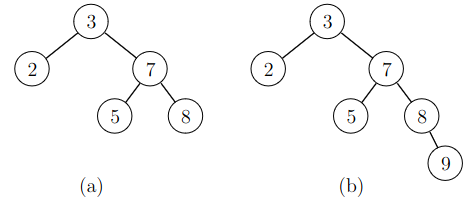
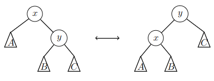
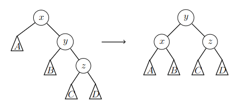
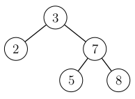
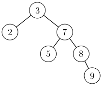
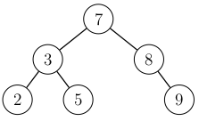
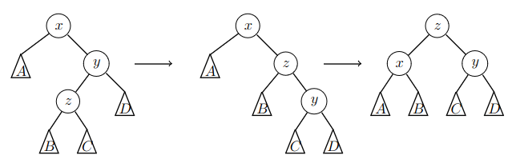
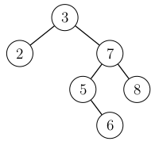
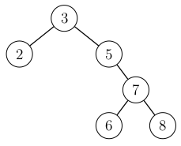
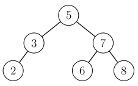

    
# AVL tree

_AVL tree_ is a balanced binary search tree with a height $$O(\log n)$$ when there are $n$ nodes. This ensures that operations on a set implemented using an AVL tree have time complexity $$O(\log n)$$.

_AVL-puu_ (_AVL_ tree) on tasapainoinen binäärihakupuu, jonka korkeus on $$O(\log n)$$, kun puussa on $$n$$ solmua. Tämän ansiosta AVL-puuta käyttävässä joukossa operaatioiden aikavaativuus on $$O(\log n)$$.

## Balance condition

An AVL tree maintains the following balance condition: For each node, the heights of the left subtree and the right subtree cannot differ more than $$1$$.

In the following image, the tree on the left satsifies the balance condition, but the tree on the right does not, because the heights of subtrees of the node $$3$$ are $$0$$ and $$2$$.

AVL-puun tasapainoehtona on, että jokaisessa solmussa vasemman ja oikean alipuun korkeuksien ero saa olla enintään $$1$$.

Seuraavassa kuvassa vasemmassa puussa tasapainoehto on voimassa, mutta oikeassa puussa se ei ole voimassa, koska solmussa $$3$$ vasemman alipuun korkeus on $$0$$ ja oikean alipuun korkeus on $$2$$.

The balance condition means that the nodes are relatively evenly distributed to different areas of the tree, which ensures that the height is $$O(\log n)$$. This can be proven by calculating how the height depends on the number of nodes.

Let $$f(h)$$ be the smallest number of nodes possible for an AVL tree of height $$h$$. The first values of the function are $$f(0)=1$$ and $$f(1)=2$$. For larger heights, the function can be computed using the formula

Tasapainoehdon hyötynä on, että sen ansiosta solmut jakautuvat tasaisesti eri puolille puuta ja puun korkeus on $$O(\log n)$$. Tämä voidaan perustella laskemalla, miten solmujen määrä vaikuttaa puun korkeuteen.

Olkoon $$f(h)$$ pienin mahdollinen solmujen määrä puussa, jonka korkeus on $$h$$. Funktion ensimmäiset arvot ovat $$f(0)=1$$ ja $$f(1)=2$$. Suuremmissa tapauksissa funktion arvo saadaan laskettua kaavalla

$$f(h) = f(h-2)+f(h-1)+1,$$

because the smallest tree of height $$h$$ is obtained by having the smallest tree of height $$h-2$$ as one subtree and the smallest tree of height $$h-1$$ as the other subtree. For example, $$f(2)=f(0)+f(1)+1=4$$ and $$f(3)=f(1)+f(2)+1=7$$.

With this we can find an estimate on the upper bound on the height of a tree with $$n$$ nodes. The upper bound is the largest $$h$$ such that $$f(h) \le n$$, because any tree of height more than $$h$$ would need to have more than $$n$$ nodes.

When $h \ge 2$$, we can estimate the value $$f(h)$$ as follows:

koska pienin korkeuden $$h$$ puu saadaan valitsemalla toiseksi alipuuksi pienin korkeuden $$h-2$$ puu ja toiseksi alipuuksi pienin korkeuden $$h-1$$ puu. Esimerkiksi $$f(2)=f(0)+f(1)+1=4$$ ja $$f(3)=f(1)+f(2)+1=7$$.

Tämän avulla voidaan arvioida, kuinka korkea enintään on puu, jossa on $$n$$ solmua. Tätä voidaan arvioida etsimällä suurin $$h$$, jossa $$f(h) \le n$$, koska jos puun korkeus on $$h$$, siinä tulee olla ainakin $$f(h)$$ solmua.

Kun $$h \ge 2$$, voimme arvioida funktion $$f(h)$$ arvoa näin:

$$f(h)=f(h-2)+f(h-1)+1 > 2 f(h-2)$$

Based on this, $$f(h) > 2^{h/2}$$, which means that $$h$$ cannot be bigger than $$2 \log_2(n)$$ if $$f(h) \le n$$. Thus the height of an AVL tree is $$O(\log n)$$.

Tämän perusteella $$f(h) > 2^{h/2}$$ eli suurin $$h$$, jolle $$f(h) \le n$$, on enintään $$2 \log_2(n)$$. Niinpä puun korkeus $$h$$ on luokkaa $$O(\log n)$$.

## Heights and rotations

An AVL tree can be implemented similarly to an ordinary binary search tree. The difference is that after adding or removing an element, we must make sure that the balance condition is still satisfied.

Since the balance condition depends on the heights of subtrees, it is useful for each node to store the height of its subtree. This way the subtree heights are easily obtained whenever needed.

If the balance condition is violated, the situation can corrected using rotations in the tree. The following image illustrates the rotations in an AVL tree:

AVL-puu voidaan toteuttaa melko samalla tavalla kuin tavallinen binäärihakupuu. Erona on, että solmun lisäämisen ja poistamisen jälkeen tulee varmistaa, että tasapainoehto on edelleen voimassa.

Koska tasapainoehto liittyy alipuiden korkeuksiin, hyvä ratkaisu on tallentaa jokaiseen solmuun tieto siitä, miten korkea kyseinen alipuu on. Tämän avulla alipuun korkeus voidaan selvittää kätevästi aina tarvittaessa.

Jos puun tasapainoehto rikkoontuu, asia voidaan korjata tekemällä sopivanlaisia kiertoja puussa. AVL-puun kierrot ovat seuraavat:

Here $$x$$ and $$y$$ are nodes of the tree and $$A$$, $$B$$ and $$C$$ are subtrees. A rotation in one direction raises $$y$$ up and moves $$x$$ down, and a rotation in the other direction does the opposite. These rotations can be used for changing the heights of subtrees without violating the ordering condition of binary search trees.

Tässä $$x$$ ja $$y$$ ovat puun solmuja ja $$A$$, $$B$$ ja $$C$$ ovat alipuita. Kierto voidaan tehdä vasemmalta oikealle, jolloin $$y$$ nousee $$x$$:n yli, tai oikealta vasemmalle, jolloin $$x$$ nousee $$y$$:n yli. Näiden kiertojen avulla voidaan muuttaa alipuiden korkeuksia. Toisaalta kierrot säilyttävät solmut binäärihakupuun järjestyksessä.

## Adding an element

When an element is added to the tree, the subtree heights may change for the nodes on the route from the new node to the root. After the addition, this route is traversed and the heights are updated if necessary. If the update of a height causes a violation of the balance condition, the situation is corrected with rotations.

Let $$x$$ denote the lowest node that violates the balance condition. Let $$y$$ denote the child of $$x$$ on the route from the new node and let $$z$$ denote the child of $$y$$ on the same route. We will consider two possible cases:

Kun puuhun lisätään alkio, lisäyksen jälkeen kuljetaan alhaalta ylös lisätystä solmusta puun juureen ja päivitetään reitillä olevien solmujen korkeudet. Jos korkeuden päivityksen jälkeen jossain solmussa vasemman ja oikean alipuun korkeuksien ero on yli $$1$$, puun rakennetta muutetaan kiertojen avulla.

Merkitään $$x$$:llä alinta solmua, jossa tasapainoehto ei ole voimassa, $$y$$:llä solmun $$x$$ lasta lisätyn solmun reitillä, sekä $$z$$:llä solmun $$y$$ lasta lisätyn solmun reitillä. Tässä on kaksi mahdollista tapausta:

### Case 1

The nodes $$y$$ and $$z$$ children of the same side. In this case, we do a rotation that raises $$y$$ up and moves $$x$$ down.

For example, in the following image, $$y$$ and $$z$$ are both right children. Then the rotation moves $$x$$ to the left child of $$y$$ while $$z$$ remains the right child of $$y$$.

Solmut $$y$$ ja $$z$$ ovat samanpuoleisia lapsia. Tässä tapauksessa tehdään kierto, jolla solmu $$y$$ nostetaan ylimmäksi.

Esimerkiksi seuraavassa kuvassa solmut $$y$$ ja $$z$$ ovat oikeanpuoleisia lapsia. Tällöin solmun $$y$$ vasemmaksi lapseksi tulee $$x$$ ja oikeaksi lapseksi tulee $$z$$.

If $$y$$ and $$z$$ are both left children, a symmetric rotation to the opposite direction is performed.

Consider the following example tree:

Jos solmut $$y$$ ja $$z$$ ovat vasemmanpuoleisia lapsia, sama kierto tehdään käänteisesti.

Tarkastellaan esimerkkinä seuraavaa puuta:

When an element $$9$$ is added to the tree, its location in the tree is chosen as in a basic binary search tree:

Kun puuhun lisätään alkio $$9$$, sen paikka valitaan ensin kuten tavallisesti binäärihakupuussa:

After the addition, we traverse upwards from the new node towards the root. The balance condition is violated for the root (but not for the other nodes on the route), because the height of the left subtree is $$0$$ but the new height of the right subtree is $$2$$. This corresponds to the above situation, where $$x=3$$, $$y=7$$ and $$z=8$$.

The violation is corrected with a rotation that moves the node $$7$$ up and the node $$3$$ down:

Lisäämisen jälkeen kuljetaan ylöspäin lisätystä solmusta juureen. Lisääminen rikkoi tasapainoehdon, koska juuressa vasemman alipuun korkeus on $$0$$ ja oikean alipuun korkeus on $$2$$. Tässä $$x=3$$, $$y=7$$ ja $$z=8$$.

Korjataan tilanne tekemällä kierto, jossa solmu $$7$$ nostetaan solmun $$3$$ yli:

After the rotation, the tree is balanced.

Tämän kierron jälkeen puu on jälleen tasapainoinen.

### Case 2

The nodes $$y$$ and $$z$$ are children of different sides. Then we need two rotations: first the node $$z$$ is raised up and $$y$$ is pushed down, and then the node $$z$$ is raised up again and the node $$x$$ is pushed down.

For example, in the following image, the node $$y$$ is a right child and the node $$z$$ is a left child. After the rotations, $$x$$ is the left child and $$y$$ the right child of $$z$$.

Solmut $$y$$ ja $$z$$ ovat eripuoleisia lapsia. Tällöin tehdään kaksi kiertoa: ensin solmu $$z$$ nostetaan solmun $$y$$ yli, ja sitten solmu $$z$$ nostetaan solmun $$x$$ yli.

Esimerkiksi seuraavassa kuvassa solmu $$y$$ on oikeanpuoleinen lapsi ja solmu $$z$$ on vasemmanpuoleinen lapsi. Tällöin solmun $$z$$ vasemmaksi lapseksi tulee $$x$$ ja oikeaksi lapseksi tulee $$y$$.

If $$y$$ is a left child and $$z$$ is a right child, symmetric rotations in the opposite direction are performed.

Jos solmut $$y$$ ja $$z$$ ovat eri päin, samat kierrot tehdään käänteisesti.

Consider the following example tree:

Tarkastellaan esimerkkinä seuraavaa puuta:

When an element $$6$$ is added, its location in the tree is chosen as in any binary search tree:

Kun puuhun lisätään alkio $$6$$, sen paikka valitaan ensin kuten tavallisesti binäärihakupuussa:

After the addition, the route from the new node to the root is traversed. The balance condtion is violated in the root, because the height of the left subtree is $$0$$ but the new height of the right subtree is $$2$$. This corresponds to the above situation, where $$x=3$$, $$y=7$$ and $$z=5$$.

To correct the violation, we first do a rotation that moves the node $$5$$ up and the node $$7$$ down:

Lisäämisen jälkeen kuljetaan ylöspäin lisätystä solmusta juureen. Lisääminen rikkoi tasapainoehdon, koska juuressa vasemman alipuun korkeus on $$0$$ ja oikean alipuun korkeus on $$2$$. Tässä $$x=3$$, $$y=7$$ ja $$z=5$$.

Tehdään ensin kierto, jossa solmu $$5$$ nostetaan solmun $$7$$ yli:

Then another rotation moves the node $$5$$ up and the node $$3$$ down:

Tehdään sitten kierto, jossa solmu $$5$$ nostetaan solmun $$3$$ yli:

After the rotations, the tree is balanced.

Näiden kiertojen jälkeen puu on jälleen tasapainoinen.

### Time complexity

After an addition, we traverse to the root and perform rotations if necessary. Since the height of the tree is $$O(\log n)$$ and each rotation takes $$O(1)$$ time, the total time complexity of addition incuding rotations is $$O(\log n)$$. In fact, it can be shown that performing rotations in more than one place per addition is never needed.

Lisäyksen jälkeen kuljetaan reitti ylös juureen ja tehdään tarvittaessa kiertoja. Koska puun korkeus on $$O(\log n)$$ ja kierrot vievät aikaa $$O(1)$$, lisääminen vie aikaa $$O(\log n)$$. Voidaan osoittaa, että solmun lisääminen rikkoo tasapainoehdon enintään yhdessä solmussa, minkä ansiosta kiertoja täytyy tehdä enintään yhdessä puun kohdassa.

## Removing an element

Removing an element in an AVL tree can be performed similarly in $$O(\log n)$$ time by doing first a standard binary tree removal, and then updating subtree heights on the route to the root, and performing rotations to maintain the balance condition when necessary. However, we do not cover element removal in further detail on this course.

Alkion poistaminen voidaan toteuttaa myös tehokkaasti $$O(\log n)$$-ajassa poistamalla alkio ensin tavallisen binäärihakupuun tapaan ja kulkemalla sitten ylös juureen ja korjaamalla tarvittaessa tasapainoehdot sopivilla kierroilla. Emme kuitenkaan käsittele alkion poistamista tarkemmin tällä kurssilla.
