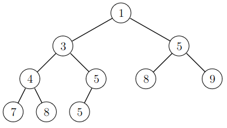
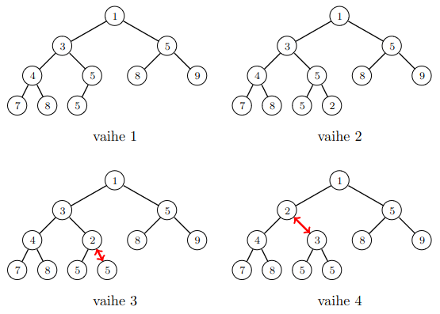

# Heap

_Heap_ is a data structure that supports the operations: (1) add a new element, (2) find the smallest/largest element, and (3) remove the smallest/largest element.

If the heap is a _min heap_, the operations (2) and (3) find and remove the smallest element. On the other hand, in a _max heap_, the operations (2) and (3) find and remove the largest element.

_Keko_ (_heap_) on tietorakenne, jonka tyypillisiä operaatioita ovat (1) uuden alkion lisääminen, (2) pienimmän/suurimman alkion hakeminen sekä (3) pienimmän/suurimman alkion poistaminen.

Jos keko on _minimikeko_ (_min heap_), operaatiot (2) ja (3) hakevat ja poistavat pienimmän alkion. Jos taas keko on _maksimikeko_ (_max heap_), operaatiot (2) ja (3) hakevat ja poistavat suurimman alkion.

The heap is usually implement as a _binary heap_, which is based on the tree structure _binary tree_. Each binary tree node can have a left child and a right child. In a heap, all the levels of the tree are full, i.e, contain as many elements as possible, except the deepest level, where the elements are as far to the left as possible.

In a min heap, the element in a node is larger than or equal to the element in the parent of the node. In a max heap, the element in a node is smaller than or equal to the element in the parent node. This ensures that the element in the root is the smallest/largest element in the tree.

Tavallinen keon toteutus on _binäärikeko_ (_binary heap_), jonka taustalla on puurakenne _binääripuu_ (_binary tree_). Jokaisella binääripuun solmulla voi olla vasen ja oikea lapsi. Keko on täytetty niin, että alkiot ovat mahdollisimman ylhäällä puussa ja viimeisellä tasolla mahdollisimman vasemmalla.

Minimikeossa jokaisen solmun alkio on yhtä suuri tai suurempi kuin solmun vanhemman alkio. Maksimikeossa puolestaan jokaisen solmun alkio on yhtä suuri tai pienempi kuin solmun vanhemman alkio. Tämän ansiosta minimikeon juurena on pienin alkio ja maksimikeon juurena on suurin alkio.

## Example

The following min heap contains the elements $$[1,3,4,5,5,5,7,8,8,9]$$:

Seuraava minimikeko sisältää alkiot $$[1,3,4,5,5,5,7,8,8,9]$$:



The contents of a heap can be stored as a list that contains the elements level by level starting from the top. For example, the above heap is stored as the list $$[1,3,5,4,5,8,9,7,8,5]$$. If an element is at the list position $$k$$, its left child is at the position $$2k+1$$, its right child is at the position $$2k+2$$, and its parent is at the position $$\lfloor (k-1)/2 \rfloor$$. As an example, consider the element $$3$$ at the position $$1$$. Its children are at the positions $$3$$ and $$4$$ and its parent is at the position $$0$$.

Keon sisältö voidaan esittää listana, joka sisältää keon alkiot taso kerrallaan ylhäältä alas. Esimerkiksi yllä olevaa kekoa vastaa lista $$[1,3,5,4,5,8,9,7,8,5]$$. Kun alkio on listassa kohdassa $$k$$, sen vasen lapsi on kohdassa $$2k+1$$, oikea lapsi on kohdassa $$2k+2$$ ja vanhempi on kohdassa $$\lfloor (k-1)/2 \rfloor$$. Esimerkiksi alkio $$3$$ on kohdassa $$1$$, sen lapset ovat kohdissa $$3$$ ja $$4$$ ja sen vanhempi on kohdassa $$0$$.

## Adding an element

A new element is initially inserted at the end of the list which corresponds to the bottom of the heap. Then the element lifted up in the heap level by level until it is at the correct position. In each step, the element is swapped with its parent.

The following picture shows how the element $$2$$ is added to the example heap. It is first inserted at the bottom and then lifted up two levels.

Uusi alkio lisätään uudeksi solmuksi keon pohjalle listan loppuun. Tämän jälkeen alkiota nostetaan ylöspäin taso kerrallaan, kunnes se on oikealla paikalla keossa. Joka vaiheessa vaihdetaan keskenään solmun ja sen vanhemman sisältö.

Seuraava kuva näyttää, miten alkio $$2$$ voidaan lisätä kekoon. Alkio lisätään aluksi keon pohjalle, minkä jälkeen se nostetaan kaksi tasoa ylöspäin.



The time complexity of an addition is $$O(\log n)$$, because each step moves one level up and the heap has $$O(\log n)$$ levels.

Alkion lisääminen vie aikaa $$O(\log n)$$, koska alkio nousee jonkin määrän tasoja ylöspäin keossa ja keon tasojen määrä on $$O(\log n)$$.

## Removing an element

When the element at the root of a heap is removed, the root is first filled by moving the last element of the heap to the root. Then the element moved down level by level until it is in its correct place in the heap.

The following picture shows how the element $$1$$ is removed from the heap. It is first replaced by the element $$5$$, which is then moved down.

Keon juuressa oleva alkio voidaan poistaa siirtämällä sen tilalle keon viimeinen alkio. Tämän jälkeen juuressa olevaa alkiota lasketaan alaspäin taso kerrallaan, kunnes se on oikealla paikalla keossa.

Seuraava kuva näyttää, miten pienin alkio $$1$$ voidaan poistaa keosta. Sen tilalle siirretään keon pohjalta alkio $$5$$, joka lasketaan sitten alaspäin.


Removing an element takes $$O(\log n)$$ time, because each step moves one level down and the heap has $$O(\log n)$$ levels.

Alkion lisääminen vie aikaa $$O(\log n)$$, koska alkio laskeutuu jonkin määrän tasoja alaspäin keossa ja keon tasojen määrä on $$O(\log n)$$.

## Heap as a list

In Python, inspecting a heap is easy, since the contents are stored in a list. The following code shows how the list changes as elements are added and removed in the above examples.

Pythonin keon toimintaa on helppoa tutkia, koska keon sisältö on aina saatavilla listana. Esimerkiksi seuraava koodi näyttää, miten lista muuttuu, kun lisätään ja poistetaan alkio äskeisten esimerkkien mukaisesti.

```python
import heapq

heap = [1, 3, 5, 4, 5, 8, 9, 7, 8, 5]

heapq.heappush(heap, 2)
print(heap) # [1, 2, 5, 4, 3, 8, 9, 7, 8, 5, 5]

heap = [1, 3, 5, 4, 5, 8, 9, 7, 8, 5]

heapq.heappop(heap)
print(heap) # [3, 4, 5, 5, 5, 8, 9, 7, 8]
```

The module `heapq` also provides a function 'heapify` that turns an exixting list into a heap:

Moduulissa `heapq` on saatavilla myös funktio `heapify`, joka muuttaa olemassa olevan listan keoksi:

```python
import heapq

items = [8, 7, 6, 5, 4, 3, 2, 1]

heapq.heapify(items)
print(items) # [1, 4, 2, 5, 8, 3, 6, 7]
```

The time complexity of the function `heapify` is $$O(n)$$, which makes it more efficient than inserting an element $$n$$ times into an initially empty heap. Inserting the elements one by one would take $$O(n \log n)$$ time, because the time complexity of the function `heappush` is $$O(\log n)$$.

Funktion `heapify` aikavaativuus on $$O(n)$$, eli sen käyttäminen on tehokkaampaa kuin suorittaa $$n$$ kertaa funktio `heappush` tyhjään kekoon. Tässä kuluisi aikaa $$O(n \log n)$$, koska funktio `heappush` vie aikaa $$O(\log n)$$.
