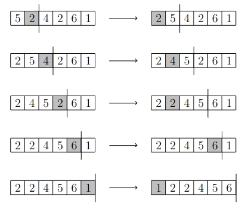

# Insertion sort

_Insertion sort_ is a simple sorting algorithm with time complexity $$O(n^2)$$.

The algorithm goes through the list from left to right. At each position, the element at that position is moved to the left so that it is in the beginning of the list is in correct order up to that position. When the algorithm has processed all positions, the whole list is in order.

_Lisäysjärjestäminen_ (_insertion sort_) on yksinkertainen järjestämisalgoritmi, jonka aikavaativuus on $$O(n^2)$$.

Algoritmi käy läpi listan kohdat vasemmalta oikealle. Jokaisessa listan kohdassa algoritmi siirtää kyseisessä kohdassa olevaa alkiota sopivan määrän vasemmalle niin, että listan alkuosa kyseiseen kohtaan asti on järjestyksessä. Kun algoritmi on käynyt läpi kaikki listan kohdat, koko lista on järjestyksessä.

## Example

The following picture illustrates the operation of insertion sort when sorting the list $$[5,2,4,2,6,1]$$.

Seuraava kuva näyttää, miten lisäysjärjestäminen järjestää listan $$[5,2,4,2,6,1]$$.



## Implementation

Insertion sort can be implemented in Python as follows:

Lisäysjärjestäminen voidaan toteuttaa seuraavasti Pythonilla:

```python
def swap(items, a, b):
    temp = items[a]
    items[a] = items[b]
    items[b] = temp

def insertion_sort(items):
    for i in range(1, len(items)):
        for j in range(i - 1, -1, -1):
            if items[j] > items[j + 1]:
                swap(items, j, j + 1)
            else:
                break
        
numbers = [5, 2, 4, 2, 6, 1]
insertion_sort(numbers)
print(numbers) # [1, 2, 2, 4, 5, 6]
```

The function `insertion_sort` sorts the given list using insertion sort. The function has two nested loops. The first loop goes through the list positions from left to right, and the second loop moves the element in the current position to its correct sorted position among the elements up to that position. The moving of an element is done using the function `swap` that swaps the positions of two elements.

Notice that the above function `insertion_sort` is intended for illustrating insertion sort and not as an example of the best way to implement sorting in Python. It is better to use the built-in implementations `sort` and `sorted` in Python.

Funktio `insertion_sort` järjestää sille annetun listan lisäysjärjestämisen avulla. Funktiossa on kaksi sisäkkäistä silmukkaa, joista ensimmäinen käy läpi listan kohdat vasemmalta oikealle ja toinen siirtää käsiteltävän alkion oikealle paikalle listan alkuosassa. Käytössä on apufunktio `swap`, joka vaihtaa keskenään kaksi listassa olevaa alkiota niiden kohtien perusteella.

Huomaa, että funktion `insertion_sort` tarkoituksena on havainnollistaa, miten lisäysjärjestäminen toimii, eikä antaa esimerkkiä siitä, miten järjestäminen kannattaa toteuttaa Python-ohjelmoinnissa. Funktion `insertion_sort` sijasta järjestämiseen kannattaa käyttää Pythonin valmiita menetelmiä (`sort` tai `sorted`).

## Efficiency

The time complexity of insertion sort is $$O(n^2)$$ because it has two nested loops. The worst case for the algorithm is if the initial list is in reverse order. Then every element has to be moved all the way to the beginning of the list step by step.

A more precise measure of the efficiency of insertion sort is the number of _inversions_. A pair of numbers $$(a,b)$$ is an inversion if $$a<b$$ and the list elements at the positions $$a$$ and $$b$$ are in wrong order. For example, in the list $$[5,2,4,2,6,1]$$ the inversions are $$(0,1)$$, $$(0,2)$$, $$(0,3)$$, $$(0,5)$$, $$(2,3)$$, $$(2,5)$$ ja $$(4,5)$$.

Every swap made by the algorithm removes one inversion from the list, and the final sorted list has no inversions. Thus the number of swaps performed by the algorithm is equal to the number of inversions on the original list. When the list is in reverse order, the number of inversions is $$n(n-1)/2$$ which is of order $$O(n^2)$$.

Any sorting algorithm that operates by swapping adjacents elements cannot have a better time complexity than $$O(n^2)$$. This because the number of inversion can be $$O(n^2)$$ and each swap removes only one inversion. Efficient sorting algorithms move elements more efficiently than by swapping adjacent elements.

Lisäysjärjestäminen vie aikaa $$O(n^2)$$, koska se muodostuu kahdesta sisäkkäisestä silmukasta. Pahin tapaus algoritmille on käänteisessä järjestyksessä oleva lista, jossa jokainen alkio täytyy siirtää listan alkuun askel kerrallaan.

Lisäysjärjestämisen tehokkuutta kuvaa tarkemmin listan _inversioiden_ määrä. Lukupari $$(a,b)$$ on inversio, jos $$a<b$$ ja listan alkiot kohdissa $$a$$ ja $$b$$ ovat väärässä järjestyksessä. Esimerkiksi listassa $$[5,2,4,2,6,1]$$ inversiot ovat $$(0,1)$$, $$(0,2)$$, $$(0,3)$$, $$(0,5)$$, $$(2,3)$$, $$(2,5)$$ ja $$(4,5)$$.

Jokainen lisäysjärjestämisen tekemä kahden alkion vaihto (koodissa funktion `swap` kutsuminen) poistaa listasta yhden inversion. Niinpä lisäysjärjestämisen vaihtojen määrä on yhtä suuri kuin listan inversioiden määrä. Kun lista on käänteisessä järjestyksessä, inversioiden määrä on $$n(n-1)/2$$ eli luokkaa $$n^2$$.

Jos järjestämisalgoritmi vaihtaa aina kahden vierekkäin olevan alkion järjestyksen, algoritmin aikavaativuus ei voi olla parempi kuin $$O(n^2)$$. Syynä tähän on, että inversioiden määrä voi olla luokkaa $$n^2$$ ja jokainen vaihto poistaa vain yhden inversion. Tehokkaat järjestämisalgoritmit pystyvät siirtämään alkioita tehokkaammin kuin vaihtamalla keskenään vierekkäisiä alkioita.
