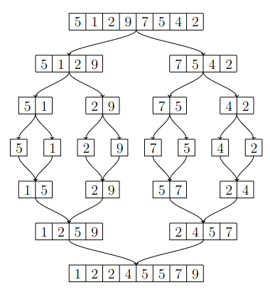

# Merge sort

_Merge sort_ is an efficient sorting algorithm with time complexity $$O(n \log n)$$.

The algorithm uses recursion to first sort the first half and the second half of the list separately. Then it merges the two sorted halfs into the full sorted list. Once the two halfs are sorted, the merging can be implemented efficiently.

_Lomistusjärjestäminen_ (_merge sort_) on tehokas järjestämisalgoritmi, jonka aikavaativuus on $$O(n \log n)$$.

Algoritmi järjestää listan rekursiivisesti niin, että se järjestää ensin erikseen listan vasemman ja oikean puoliskon. Tämän jälkeen se yhdistää järjestetyn vasemman ja oikean puoliskon kokonaiseksi järjestetyksi listaksi. Koska vasen ja oikea puolisko ovat valmiiksi järjestyksessä, niiden yhdistäminen voidaan toteuttaa tehokkaasti.

Algoritmi hyödyntää rekursiota niin, että se järjestää listan vasemman ja oikean puoliskon kutsumalla itseään. Rekursio päättyy, kun listalla on vain yksi alkio, jolloin listaa ei tarvitse järjestää vaan se on valmiiksi järjestyksessä.

## Example

The following image illustrates merge sort on the list $$[5,1,2,9,7,5,4,2]$$.

Seuraava kuva näyttää, miten lisäysjärjestäminen järjestää listan $$[5,1,2,9,7,5,4,2]$$.



## Implementation

Merge sort can be implemented in Python as follows:

Lomitusjärjestäminen voidaan toteuttaa seuraavasti Pythonilla:

```python
def merge_sort(items):
    n = len(items)

    if n <= 1: return

    left = items[0:n//2]
    right = items[n//2:]

    merge_sort(left)
    merge_sort(right)

    a = b = 0
    for i in range(n):
        if b == len(right) or \
           (a < len(left) and left[a] < right[b]):
            items[i] = left[a]
            a += 1
        else:
            items[i] = right[b]
            b += 1
        
numbers = [5, 2, 4, 2, 6, 1]
merge_sort(numbers)
print(numbers) # [1, 2, 2, 4, 5, 6]
```

The function `merge_sort` sorts the given list using merge sort. If the list has at most one element, the function does nothing. Otherwise, the function splits the list into two halfs `left` and `right` and sort them recursively.

After sorting the halfs, the algorithms constructs the full sorted list. To do this, the algorithm goes through the positions of the list from left to right and fills each position with the smallest remaining element from the lists `left` and `right`. Since the two half lists are already in order, the smallest remaining element in each is found efficiently.

Notice that the above function `merge_sort` is intended for illustrating how merge sort works and not as an example of the best way to implement sorting in Python. It is better to use the built-in implementations `sort` and `sorted` in Python.

Funktio `merge_sort` järjestää sille annetun listan lomitusjärjestämisen avulla. Jos listalla on vain yksi alkio, funktio ei tee mitään. Muuten funktio jakaa listan kahteen puoliskoon (`left` ja `right`) ja järjestää ne rekursiivisesti.

Puoliskojen järjestämisen jälkeen funktio rakentaa kokonaisen järjestetyn listan. Tämä on toteutettu niin, että funktio käy listan kohdat läpi vasemmalta oikealle ja valitsee jokaiseen kohtaan mahdollisimman pienen jäljellä olevan alkion listasta `left` tai `right`. Koska puoliskot ovat järjestyksessä, kummankin puoliskon pienin alkio löytyy tehokkaasti joka vaiheessa.

Huomaa, että funktion `merge_sort` tarkoituksena on havainnollistaa, miten lomitusjärjestäminen toimii, eikä antaa esimerkkiä siitä, miten järjestäminen kannattaa toteuttaa Python-ohjelmoinnissa. Funktion `merge_sort` sijasta järjestämiseen kannattaa käyttää Pythonin valmiita menetelmiä (`sort` tai `sorted`).

## Efficiency

The time complexity $$O(n \log n)$$ of merge sort comes from the facts that there are $$O(\log n)$$ levels of recursion and that the merging on each level takes $$O(n)$$ time. The number of recursion levels is $$O(\log n)$$, because when a list of length $$n$$ is halved $$\log n$$ times, the list has only one element remaining and the recursion ends.

The merging on each level happens as follows:

* On the level 1, two lists of length $$n/2$$ are merged into one list of length $$n$$.
* On the level 2, four lists of length $$n/4$$ are merged into two lists of length $$n/2$$.
* On the level 3, eight lists of length $$n/8$$ are merged into four lists of length $$n/4$$.
* etc.

The total number of elements processed at each level is $$O(n)$$, and thus the merging time per level is $$O(n)$$.

Lisäysjärjestämisen aikavaativuus $$O(n \log n)$$ johtuu siitä, että algoritmissa on $$O(\log n)$$ rekursiivista tasoa ja jokaisella tasolla listojen yhdistäminen vie aikaa $$O(n)$$. Rekursiivisten tasojen määrä saadaan siitä, että kun $$n$$-kokoinen lista puolitetaan $$\log n$$ kertaa, listalla on vain yksi alkio ja rekursio päättyy.

Tasot muodostuvat seuraavasti:

* Tasolla 1 kaksi $$n/2$$-kokoista listaa yhdistyy yhdeksi $$n$$-kokoiseksi listaksi.
* Tasolla 2 neljä $$n/4$$-kokoista listaa yhdistyy kahdeksi $$n/2$$-kokoiseksi listaksi.
* Tasolla 3 kahdeksan $$n/8$$-kokoista listaa yhdistyy neljäksi $$n/4$$-kokoiseksi listaksi.
* Jne.

Jokaisella tasolla listoissa on yhteensä $$O(n)$$ alkiota, minkä takia jokaisen tason listojen yhdistämiset vievät yhteensä aikaa $$O(n)$$.
